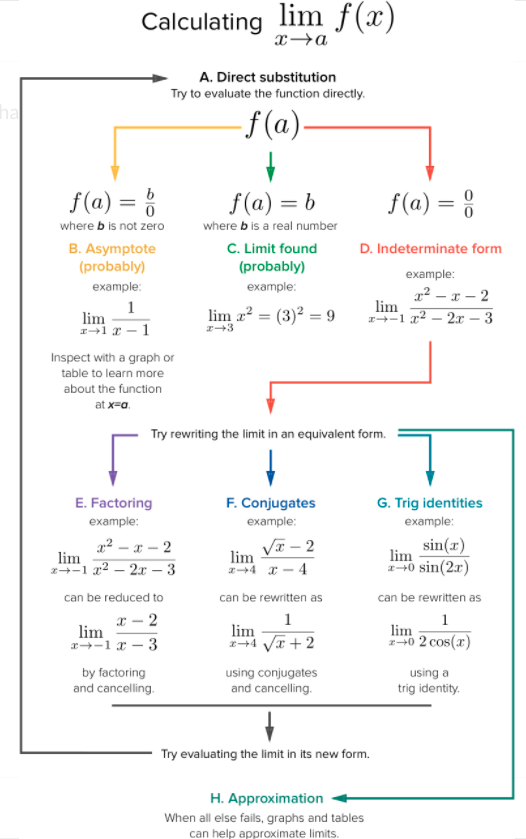

The following are my personal notes from relearning calculus using the following resources:

- [Khan Academy AP Calculus BC](https://www.khanacademy.org/math/ap-calculus-bc)
- [Paul's Online Notes](https://tutorial.math.lamar.edu/)
taking the online class: [Introduction to Linear Algebra - MIT OCW 18.06](https://ocw.mit.edu/courses/mathematics/18-06-linear-algebra-spring-2010/index.htm)

## Strategy to Find Limits

- When finding limits, the answer of \(\frac{0}{0}\) is much different than \(\frac{b}{0}\)
- Squeeze Theorem - Alternate Names:
  1. Pinching Theorem
  2. Sandwich Theorem
  3. Two officers and a drunk theorem
- Squeeze Theorem (formula): Let \(I\) be an interval having the point \(a\) as a limit point. Let \(g\), \(f\), \(h\) be functions defined in \(I\), except possibly at \(a\) itself. Suppose that for every \(x\) in \(I\) not equal to \(a\), we have: 

  - \(g(x) \le f(x) \le h(x)\)
  - and also suppose that 
  - \(\displaystyle{\lim_{x \rightarrow a} g(x)=\lim_{x \rightarrow a} h(x) = L}\)
  - Then \(\displaystyle{\lim_{x \rightarrow a} f(x)= L}\)
- Types of discontinuity: 
  1. Point Removal Discontinuity - a point is "missing" from the function 
  2. Jump Continuity - Have to lift pencil; the left and right limits are not the same
  3. Asymptotic Discontinuity - functions head towards asymptote; limit is undefined
- Limit (precise definition): We say \(\displaystyle{\lim_{x \rightarrow a}} f(x) = L\) if for every \(\epsilon > 0\) there is a \(\delta > 0\) such that whenever \(0 < \lvert x - a \rvert < \delta\) then \(\lvert f(x) - L \rvert < \epsilon\)
- Limit (working definition): We say \(\displaystyle{\lim_{x \rightarrow a}} f(x) = L\) if we can make \(f(x)\) as close to \(L\) as we want by taking \(x\) sufficiently close to \(a\) (on either side of \(a\)) without letting \(x=a\)
- Right Hand Limit: \(\displaystyle{\lim_{x \rightarrow a^+}} f(x) = L\); the same definition as the limit except it requires \(x>a\)
- Left Hand Limit: \(\displaystyle{\lim_{x \rightarrow a^-}} f(x) = L\); the same definition as the limit except it requires \(x<a\)
- Limit at inftyity: We say \(\displaystyle{\lim_{x \rightarrow \infty}} f(x) = L\) if we can make \(f(x)\) as close to \(L\) as we want by taking \(x\) large enough and positive
- Limit at Negative inftyity: We say \(\displaystyle{\lim_{x \rightarrow \infty^-}} f(x) = L\) if we can make \(f(x)\) as close to \(L\) as we want by taking \(x\) large enough and negative
- inftyite Limit: We say \(\displaystyle{\lim_{x \rightarrow a}} f(x) = \infty\) if we can make \(f(x)\) arbitrarily large (an positive) by taking \(x\) sufficiently close to \(a\) (on either side of \(a\)) without letting \(x=a\)
- Negative inftyite Limit: We say \(\displaystyle{\lim_{x \rightarrow a}} f(x) = -\infty\) if we can make \(f(x)\) arbitrarily large (and negative) by taking \(x\) sufficiently close to \(a\) (on either side of \(a\)) without letting \(x=a\)
- Relationship between Limit and One Sided Limits: 
\[\displaystyle{\lim_{x \rightarrow a}} f(x) = L \implies \displaystyle{\lim_{x \rightarrow a^+}} f(x) = \displaystyle{\lim_{x \rightarrow a^-}} f(x) = L\]
- Relationship between One Sided Limits and Limit (Exists): 
\[\displaystyle{\lim_{x \rightarrow a^+}} f(x) = \displaystyle{\lim_{x \rightarrow a^-}} f(x) = L \implies \displaystyle{\lim_{x \rightarrow a}} f(x) = L\]
- Relationship between One Sided Limits and Limit (Doesn't Exist): \[\displaystyle{\lim_{x \rightarrow a^+}} f(x) \ne \displaystyle{\lim_{x \rightarrow a^-}} f(x) \implies \displaystyle{\lim_{x \rightarrow a}} f(x) \text{ \\Does Not Exist}\]
- Limit Property (scalar Multiplication): 
\[\displaystyle{\lim_{x \rightarrow a}} [cf(x)]=c\displaystyle{\lim_{x \rightarrow a}}f(x)\]
- Limit Property (Limit Addition): 
\[\displaystyle{\lim_{x \rightarrow a}} [f(x) \pm g(x)] = \displaystyle{\lim_{x \rightarrow a}}f(x) \pm \displaystyle{\lim_{x \rightarrow a}}g(x)\]
- Limit Property (Limit Multiplication): 
\[\displaystyle{\lim_{x \rightarrow a}} [f(x) g(x)] = \displaystyle{\lim_{x \rightarrow a}}f(x) \displaystyle{\lim_{x \rightarrow a}}g(x)\]
- Limit Property (Limit Division): 
\[\displaystyle{\lim_{x \rightarrow a}} \left[ \frac{f(x)}{g(x)} \right] = \frac{\displaystyle{\lim_{x \rightarrow a}}f(x)}{\displaystyle{\lim_{x \rightarrow a}}g(x)} \text{\; Provided\;} \displaystyle{\lim_{x \rightarrow a}}g(x) \ne 0\]
- Limit Property (Limit Exponent): 
\[\displaystyle{\lim_{x \rightarrow a}} [f(x)]^n = \left [ \displaystyle{\lim_{x \rightarrow a}} f(x) \right ]^n\]
- Limit Property (Limit Root): 
\[\displaystyle{\lim_{x \rightarrow a}} [ \sqrt[n]{f(x)} ] =  \sqrt[n]{\displaystyle{\lim_{x \rightarrow a}} f(x)}\]
- Limit Evaluations at \(\pm \infty\) [\(\rm{e}^x\)]:
\[
\begin{align*}
\displaystyle{\lim_{x \rightarrow \infty}} \rm {e}^x &= \infty\\
\displaystyle{\lim_{x \rightarrow -\infty}} \rm {e}^x &= 0\\
\end{align*}
\]
- Limit Evaluations at \(\pm \infty\) [\(\rm{ln}(x)\)]:
\[
\begin{align*}
\displaystyle{\lim_{x \rightarrow \infty}} \rm {ln}(x) &= \infty\\
\displaystyle{\lim_{x \rightarrow 0^+}} \rm {ln}(x) &= -\infty\\
\end{align*}
\]
- Limit Evaluations at \(\pm \infty\) [\( x^n\) \(n\) is odd]:
\[
\begin{align*}
\displaystyle{\lim_{x \rightarrow \infty}} x^n &= \infty\\
\displaystyle{\lim_{x \rightarrow -\infty}} x^n &= -\infty\\
\end{align*}
\]
- Limit Evaluations at \(\pm \infty\) [fraction with exponent]: 
  - If \(r>0\) then 
    - \(\displaystyle{\lim_{x \rightarrow \infty}} \frac{b}{x^r}=0\)
    - \(\displaystyle{\lim_{x \rightarrow -\infty}} \frac{b}{x^r}=0\) when \(x^r\) is real for negative \(x\)
- Limit Evaluations at \(\pm \infty\) [\(x^n\) \(n\) is even]: 
\[\displaystyle{\lim_{x \rightarrow \pm \infty}} {x^n}=\infty\]
- Limit Evaluations at \(\pm \infty\) [polynomial \(n\) is even]: 
\[\displaystyle{\lim_{x \rightarrow \pm \infty}} a{x^n}+\dots+bx+c=sign(a)\times\infty\]
- Limit Evaluations at \(\pm \infty\) [polynomial \(n\) is odd]: 
\[
\begin{align*}
\displaystyle{\lim_{x \rightarrow \infty}} a{x^n}+\dots+bx+c&=sign(a) \times \infty\\
\displaystyle{\lim_{x \rightarrow -\infty}} a{x^n}+\dots+bx+c&= -1 \times sign(a) \times \infty\\
\end{align*}
\]
- Continuous Function: If \(f(x)\) is continuous at \(a\) then \(\displaystyle{\lim_{x \rightarrow a}} f(x)=f(a)\)
- Continuous Function and Composition: If \(f(x)\) is continuous at \(b\) and \(\displaystyle{\lim_{x \rightarrow a}} g(x)=b\) then \(\displaystyle{\lim_{x \rightarrow a}} f(g(x))=f \left ( \displaystyle{\lim_{x \rightarrow a}} g(x)\right ) = f(b)\)
- L'Hospital's Rule: If \(\displaystyle{\lim_{x \rightarrow a}} \frac{f(x)}{g(x)}=\frac{0}{0}\) or \(\displaystyle{\lim_{x \rightarrow a}} \frac{f(x)}{g(x)}=\frac{\pm \infty}{\pm \infty}\) then,
\(\displaystyle{\lim_{x \rightarrow a}} \frac{f(x)}{g(x)}=\displaystyle{\lim_{x \rightarrow a}} \frac{f'(x)}{g'(x)} a\) is a number, \(\infty\) or \(-\infty\)
- What is the strategy to determine the limit in general (and for piecewise function in particular)? Compute the two one-sided limits, compare and leverage the relationship between one-sided limits and the limit; (i.e. if both one-sided exist and equal, then limit exists)
- Some Continuous Function Examples:
  - Polynomials for all \(x\)
  - Rational function, except for \(x\)'s that give division by zero
  - \(\sqrt[n]{x}\) (\(n\) odd) for all \(x\)
  - \(\sqrt[n]{x}\) (\(n\) even) for all \(x \ge 0\)
  - \( \rm{e}^x \) for all \(x\)
  - \( \ln{x}\) for \(x > 0\)
  - \( \cos(x)\) and \(\sin(x)\) for all \( x \)
  - \( \tan(x)\) and \(\sec(x)\) provided \( x \ne \dots,-\frac{3 \pi}{2},-\frac{\pi}{2},\frac{\pi}{2},\frac{3 \pi}{2},\dots \)
  - \( \cot(x)\) and \(\csc(x)\) provided \( x \ne \dots,-2 \pi,-\pi,0,\pi,2\pi,\dots \)
  
- Intermediate Value Theorem: Suppose that \(f(x)\) is continuous on \([a,b]\) and let \(M\) be any number between \(f(a)\) and \(f(b)\). Then there exists a number \(x\) such that \(a<c<b\) and \(f(c)=M\)