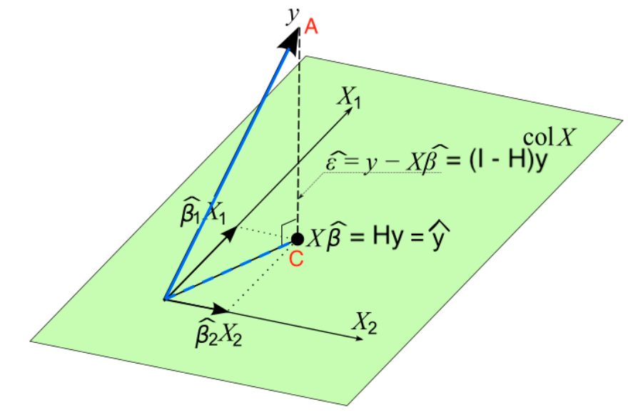

```{r echo=FALSE}
library(blogdown)
```
## Multiple Linear Regression (MLR)

We have $k$ distinct predictors: 
$$
\begin{align}
Y_i = \beta_0 + \beta_1 X_{i1} + \dots + \beta_k X_{ik} + \epsilon_i
\end{align}
$$

### Sample MLR Model

Given data $(x_{11},\dots,x_{1k},y_1),(x_{21},\dots,x_{2k},y_2),\dots,(x_{n1},\dots,x_{nk},y_n)$

$$
\begin{align*}
y_i &= \beta_0 + \beta_1 x_{i1} + \dots + \beta_k x_{ik} + \epsilon_i\\
&= \beta_0 + \sum_{j=1}^k\beta_j x_{ij} + \epsilon_i,\quad i=1,2,\dots,n\\
\end{align*}
$$

The fit to this equation will be a hyperplane rather than a line as in SLR.

A model with **interaction effects** may result if there is a term $x_1x_2$. It is still linear in $\beta_{12}$ and we could rewrite it as $x_3 = x_1x_2$ and let $\beta_3 = \beta_{12}$. Additionally **second order model interactions** like $...+\beta_{11}x_1^2+...$ could be rewritten as $x_3=x_1^2$ and $\beta_3 = \beta_{11}$

In summary:

> Any regression model that is linear in the parameters (i.e. the $\beta$'s) is a linear regression model, regardless of the shape of the surface that it generates 
:Montgomer, Peck, Vinning pg. 69

### Point Estimation of Model Parameters

The Least Squares function is

$$
S(\beta_0, \beta_1,\dots,\beta_k) = \sum_{i=1}^n \epsilon_i^2 = \sum_{i=1}^n \left ( y_i - \beta_0 - \sum_{j=1}^k \beta_j x_{ij} \right )^2
$$


We minimize $S$ with respect to the coefficients $\beta_0,\beta_1,\dots,\beta_k$

$$ 
\begin{align}
\frac{\partial S}{\partial {\beta_0}} \bigg\vert_{b_0,b_1,\dots,b_k} &= -2\sum_{i=1}^n \left ( y_i - b_0 - \sum_{j=1}^k b_j x_{ij} \right ) = 0\\
\frac{\partial S}{\partial {\beta_j}} \bigg\vert_{b_0,b_1,\dots,b_k} &= -2\sum_{i=1}^n \left ( y_i-b_0-\sum_{j=1}^k b_j x_{ij} \right ) x_{ij} = 0
\end{align}
$$

* $p=k+1$ equations with $p$ unknown parameters
* The ordinary least squares estimators are the solutions to the normal equations.

### Regression Model in Matrix Form

$$
\mathbf{y} = \mathbf{X} \mathbf{\beta} + \mathbf{\epsilon}
$$

where
$$
\mathbf{y} = 
\begin{bmatrix}
y_1\\
y_2\\
\vdots\\
y_n
\end{bmatrix},
\mathbf{X} = 
\begin{bmatrix}
1 & x_{11} & x_{12} & \dots & x_{1k}\\
1 & x_{21} & x_{22} & \dots & x_{2k}\\
\vdots & \vdots & \vdots & \ddots & \vdots\\
1 & x_{n1} & x_{n2} & \dots & x_{nk}\\
\end{bmatrix},
\mathbf{\beta} = 
\begin{bmatrix}
\beta_0\\
\beta_1\\
\vdots\\
\beta_k
\end{bmatrix},
\mathbf{\epsilon} = 
\begin{bmatrix}
\epsilon_1\\
\epsilon_2\\
\vdots\\
\epsilon_n
\end{bmatrix}
$$

* $\mathbf{X}$: Design matrix
* $\mathbf{\epsilon} \sim N(\mathbf{0},\sigma^2 \mathbf{I})$

### Least Squares Estimation in Matrix Form

$$
\begin{align*}
S(\mathbf{\beta}) = \sum_{i=1}^n \epsilon_i^2 &= \mathbf{\epsilon^\intercal} \mathbf{\epsilon} = (\mathbf{y} - \mathbf{X}\mathbf{\beta})^\intercal(\mathbf{y} - \mathbf{X}\mathbf{\beta})\\
&=\mathbf{y}^\intercal\mathbf{y}-
\mathbf{\beta^\intercal}\mathbf{X}^\intercal\mathbf{y}-
\mathbf{y^\intercal}\mathbf{X}\mathbf{\beta}+
\mathbf{\beta^\intercal}\mathbf{X^\intercal}\mathbf{X}\mathbf{\beta}
\end{align*}
$$
Since $\mathbf{\beta^\intercal}\mathbf{X}^\intercal\mathbf{y}$ is a $1\times1$ matrix and it's transpose $\mathbf{y^\intercal}\mathbf{X}\mathbf{\beta}$ is the same scalar we will combine the two terms and we are left with:

$$
\begin{align}
S(\mathbf{\beta}) &=\mathbf{y}^\intercal\mathbf{y}-
2\mathbf{\beta^\intercal}\mathbf{X}^\intercal\mathbf{y}+
\mathbf{\beta^\intercal}\mathbf{X^\intercal}\mathbf{X}\mathbf{\beta}
\end{align}
$$

Before we go further we need to know a few calculus matrix rules:

1. $\frac{\partial{\mathbf{t}^\intercal} \mathbf{a}}{\partial{t}} = \frac{\partial{\mathbf{a}^\intercal} \mathbf{t}}{\partial{t}} = \mathbf{a}$
2. $\frac{\partial{\mathbf{t}^\intercal} \mathbf{A} \mathbf{t}}{\partial{t}} = 2 \mathbf{A}\mathbf{t}$

With regards to equation $\textcolor{red}{(4)}$ we take each of the terms in order:

* The $\mathbf{y}^\intercal\mathbf{y}$ term does not have a $\beta$ term and therefore the derivative is 0
* With the second term: $-2\mathbf{\beta^\intercal}\mathbf{X}^\intercal\mathbf{y}$ we will use the first of the derivative rules and simply end up with $-2\mathbf{X}^\intercal\mathbf{y}$
* With the third term $\mathbf{\beta^\intercal}\mathbf{X^\intercal}\mathbf{X}\mathbf{\beta}$ we use the 2nd matrix derivative rule. So see this we let $\beta$ equal to the $t$ in the rule and $\mathbf{X}^\intercal\mathbf{X}$ be equal to the $\mathbf{A}$ and substituting in $\mathbf{b}$ for $\mathbf{\beta}$

So together we are left with:

#### Normal Equation


$$
\frac{\partial{S}}{\partial\beta}\bigg\vert_{\mathbf{b}} = -2 \mathbf{X^\intercal} \mathbf{y} + 2 \mathbf{X^\intercal} \mathbf{X} \mathbf{b} = 0
$$
and then solving for $\mathbf{b}$ we have:

$$
\begin{align}
\mathbf{b} = ( \mathbf{X}^\intercal \mathbf{X}) ^ {-1} \mathbf{X}^\intercal \mathbf{y}
\end{align}
$$

#### Hat Matrix

The vector of fitted values $\hat{y_i}$ corresponding to $y_i$ is:

$$
\mathbf{\hat{y}} = \mathbf{X} \mathbf{b} = \mathbf{X} ( \mathbf{X^\intercal} \mathbf{X})^{-1} \mathbf{X^\intercal} \mathbf{y} = \mathbf{H} \mathbf{y}
$$

Whereby the $n \times n$ matrix $\mathbf{X} ( \mathbf{X^\intercal} \mathbf{X})^{-1} \mathbf{X^\intercal}$ is called the **hat matrix**.

The vector of residuals $e_i = y_i = \hat{y_i}$ is:

$$
\mathbf{e} = \mathbf{y}-\mathbf{\hat{y}} = \mathbf{y} - \mathbf{Xb} = \mathbf{y}-\mathbf{Hy}=(\mathbf{I}-\mathbf{H})\mathbf{y}
$$

Note:

* Both $\mathbf{H}$ and $\mathbf{I-H}$ are __symmetric__ and __idempotent__. In other words, they are **projection** matrices
* $\mathbf{H}$ projects $\mathbf{y}$ to $\mathbf{\hat{y}}$ on the $p$-dimension space spanned by columns of $\mathbf{X}$, or the column space of $\mathbf{X}$, $Col(\mathbf{X})$
* $\mathbf{I-H}$ projects $\mathbf{y}$ to $\mathbf{e}$ on the space **perpendicular** to $Col(\mathbf{x})$, or $Col(X)^\bot$

### Geometrical Interpretation of Least Squares

* $Col(\mathbf{X}) = \{ \mathbf{X}\mathbf{b}: \mathbf{b} \in \mathbf{R}^p \}$
* $\mathbf{y} \notin Col(\mathbf{X})$
* $\hat{\mathbf{y}} = \mathbf{Xb} = \mathbf{Hy} \in Col(\mathbf{X})$
* Minimize the distance of $\textcolor{red}{A}$ to $Col(\mathbf{X})$: Find the point in $Col(\mathbf{X})$ that is closest to $\textcolor{red}{A}$...that is $\textcolor{red}{C}$  
* Distance is minimized when the point in spaces is the foot of the line from $\textcolor{red}{A}$ **normal** to the space. That is point $\textcolor{red}{C}$
* $\mathbf{e} = \mathbf{y}-\mathbf{\hat{y}} = \mathbf{y} - \mathbf{Xb} = \mathbf{y}-\mathbf{Hy}=(\mathbf{I}-\mathbf{H})\mathbf{y} \bot Col(\mathbf{X})$
* $\mathbf{X^\intercal} (\mathbf{y} - \mathbf{Xb})=0$
* Searching for the LS solution **b** that minimizes $SS_{Res}$ is the same as locatin the point $\mathbf{Xb} \in Col(\mathbf{X})$ that is as clost to $\mathbf{y}$ as possible!



### Properties of Least Square Estimators

Similar to Simple Linear Regression **b** is BLUE or Best Linear Unbiased Estimator.

#### 1. Best

A least square estimator is best if the variance is least.

$$
\begin{align*}
Cov(\mathbf{b}) &= E [(\mathbf{b} - E(\mathbf{b}))(\mathbf{b} - E(\mathbf{b}))^\intercal]\\
Var(\mathbf{b}) &= Var [(\mathbf{X}^\intercal \mathbf{X})^{-1}\mathbf{X}^\intercal \mathbf{y}]\\
&=\sigma^2(\mathbf{X}^\intercal \mathbf{X})^{-1}
\end{align*}
$$

#### 2. Linear

A least square estimator is a linear combination of y, which we see from equation $\textcolor{red}{(5)}$

#### 3. Unbiased

A least square estimator is unbiased if the expected value of the estimator is the same as the actual $\mathbf{\beta}$

$$
\begin{align*}
E(\mathbf{b})&=E[(\mathbf{X}^\intercal \mathbf{X})^{-1}\mathbf{X}^\intercal \mathbf{y}]\\
&=E[(\mathbf{X}^\intercal \mathbf{X})^{-1}\mathbf{X}^\intercal (\mathbf{X \beta} + \mathbf{\epsilon})]\\
&=\mathbf{\beta}
\end{align*}
$$

### Estimate of $\sigma^2$

$$
\begin{align*}
SS_{Res}= \sum_{i=1}^n (y_i - \hat{y_i})^2 &= \sum_{i=1}^n e_i^2 \\
&= \mathbf{e^\intercal e}\\
&= \mathbf{(y-Xb)^\intercal(y-Xb)}\\
&= \mathbf{y^\intercal y} - \mathbf{b^\intercal X^\intercal y} - \mathbf{y^\intercal Xb} +  \mathbf{b^\intercal X^\intercal  X b}
\end{align*}
$$

However, just as we saw with equation $\textcolor{red}{(4)}$ above $\mathbf{b^\intercal}\mathbf{X}^\intercal\mathbf{y}$ is a $1\times1$ matrix and it's transpose $\mathbf{y^\intercal}\mathbf{X}\mathbf{b}$ is the same scalar we will combine the two terms and we are left with:

$$
\begin{align*}
SS_{Res}=  \mathbf{y^\intercal y} - 2\mathbf{b^\intercal X^\intercal y} +  \mathbf{b^\intercal X^\intercal  X b}
\end{align*}
$$

However, since $\mathbf{X^\intercal X b} = \mathbf{X^\intercal y}$  we can clean up. Additionally looking at the relationship between $MS_{res}$ and $SS_{res}$:

$$
\begin{align}
SS_{Res} &=  \mathbf{y^\intercal y} - \mathbf{b^\intercal X^\intercal y}\\
MS_{Res} &= \frac{SS_{Res}}{n-p} \space \space \text{with} \space p=k+1
\end{align}
$$

* $\hat{\sigma^2}=MS_{Res}$ is an unbiased estimator for $\sigma^2$, i.e. $E[MS_{Res}] = \sigma^2$
* $\hat{\sigma^2}$ of SLR may be larger than the $\hat{\sigma^2}$ of MLR.
* $\hat{\sigma^2}$ measures the variation of the _unexplained_ noise about the fitted regression line/hyperplane, so we prefer a small residual mean square.

### Test for Significance of Regression

Test for significance: Determine if there is a **linear** relationship between the response and **andy** of the regressor varaibles.

* $H_0: \beta_1 = \beta_2 = \cdots = \beta_k = 0$ 
* $H_1: \beta_j \ne 0$ for at least one $j$

* $F_{test} > F_{\alpha,1,n-2}$
* p-value = $P(F_{1,n-2} > F_{test}) > \alpha$

Combining all these definitions we have...


```{r echo=FALSE, results='asis', escape=FALSE}
x <- data.frame("Source of Variation" = c("Regression","Residual","Total"),
                "Sum of Squares" = c(
        "$SS_R = \\mathbf{b^\\intercal X^\\intercal y} - \\frac{1}{n} \\sum_{i=1}^n y_i^2$",
      "$SS_{Res} =  \\mathbf{y^\\intercal y} - \\mathbf{b^\\intercal X^\\intercal y}$",
      "$SS_T = \\mathbf{y^\\intercal y} - \\frac{1}{n} \\sum_{i=1}^n y_i^2$"),
                "Degrees of Freedom" = c("k", "n-k-1", "n-1"),
                "Mean Square" = c("$MS_R$", "$MS_{Res}$",""),
                "$F_0$" = c("$MS_R/MS_{Res}$", "","")
                )
knitr::kable(x=x,caption = "ANOVA Table",format="markdown", escape=FALSE, col.names=c("Source of Variation","Sum of Squares","Degrees of Freedom","Mean Square","$F_{test}$"))

```
* _Note: k is # of coefficients for regressors. For SLR k = 1_

We have determined $SS_{Res}$ in equation $\textcolor{red}{(6)}$ from above. So let's look at how we can find $SS_T$

$$
\begin{align*}
SS_T &= \sum_{i=1}^n (y_i - \overline{y})^2\\
&= \sum_{i=1}^n y_i^2 + \sum_{i=1}^n -2y_i\overline{y} + \sum_{i=1}^n \overline{y}^2\\
&= \sum_{i=1}^n y_i^2 + -2 \overline{y} \sum_{i=1}^n y_i + \overline{y}^2 \sum_{i=1}^n 1\\
\end{align*}
$$

Now we leverage a relationship: $\sum_{i=1}^n y_i = n \overline{y}$ to adjust the second term and cleaning up the last term whereby $\sum_{i=1}^n 1 = n$:

$$
\begin{align*}
SS_T &= \sum_{i=1}^n y_i^2 + -2 \overline{y} n \overline{y} + \overline{y}^2 n\\
&= \sum_{i=1}^n y_i^2 + -2 n \overline{y}^2 + n \overline{y}^2\\
&= \sum_{i=1}^n y_i^2 + - n \overline{y}^2\\
\end{align*}
$$
We make two more substitution: $\overline{y} = \frac{1}{n}\sum_{i=1}^n y_i$ and the fact that $\sum_{i=1}^n y_i^2 = \mathbf{y^\intercal y}$

$$
\begin{align*}
SS_T &= \mathbf{y^\intercal y} + - n \left ( \frac{1}{n} \sum_{i=1}^n y_i\right )^2\\
&= \mathbf{y^\intercal y} + - \frac{n}{n^2} \sum_{i=1}^n y_i^2\\
&= \mathbf{y^\intercal y} - \frac{1}{n} \sum_{i=1}^n y_i^2\\
\end{align*}
$$

* $SS_T = \mathbf{y^\intercal y} - \frac{1}{n} \sum_{i=1}^n y_i^2$
* $SS_{Res} =  \mathbf{y^\intercal y} - \mathbf{b^\intercal X^\intercal y}$
* $SS_R = SS_T - SS_{Res} = \mathbf{b^\intercal X^\intercal y} - \frac{1}{n} \sum_{i=1}^n y_i^2$
* Reject $H_0$ if $F_{test} > F_{\alpha,k,n-k-1}$
* $E[MS_{Res}] = \sigma^2$
* $E[MS_R] = \sigma^2 + \frac{\beta_{1:k}^\intercal \mathbf{X_c ^\intercal X_c \beta_{1:k}}}{k\sigma^2}$ where $\beta_{1:k}=(\beta_1,\dots,\beta_k)^\intercal$ 
* $\mathbf{X_c} = 
\begin{bmatrix}
x_{11} - \overline{x_1} & x_{12} - \overline{x_2} & \dots & x_{1k}- \overline{x_k}\\
x_{21} - \overline{x_1} & x_{22} - \overline{x_2} & \dots & x_{2k}- \overline{x_k}\\
\vdots & \vdots &  \ddots & \vdots\\
x_{n1} - \overline{x_1} & x_{n2} - \overline{x_2} & \dots & x_{nk}- \overline{x_k}\\
\end{bmatrix}$

### $R^2$ and Adjusted $R^2$

#### $R^2$
* Calculated the same as SLR
$$
R^2 = \frac {SS_R}{SS_T}= \frac {SS_T - SS_{Res}}{SS_T} = 1-\frac {SS_{Res}}{SS_T}
$$
* The model with one additional predictor always gets a higher $R^2$
* Measures the proportion of variability in $Y$ that is explained by the regression model or the $k$ predictors

#### Adjusted $R^2$
$$
R_{adj}^2 = 1-\frac {SS_{Res}/(n-p)}{SS_T/(n-1)}
$$

* Applies a penalty (through p) for the number of variables included in the model

### Test on Individual Regression Coefficients

#### Partial/Marginal Test

* Tests the contribution of $X_j$ given all other regressors in the model
* $H_0:\beta_j = 0$ and $H_1: \beta_j \ne 0$
* $t_{test} = \frac{b_j}{\sqrt{\hat\sigma^2 C_{jj}}}$, where $C_{jj}$ is the $j$-th diagonal element of $(\mathbf{X^\intercal X})^{-1}$
* Reject $H_0$ if $\vert t_{test} \vert \gt t_{\alpha/2,n-k-1}$

#### Reduced Model vs. Full Model

* Overall test of significance: _all_ predictors vs. Marginal $t$-test: _one single_ predictor
* Test any subset
* **Full**: $y=\beta_0+\beta_1 x_1 + \beta_2 x_2 + \beta_3 x_3 + \beta_4 x_4 + \epsilon$
* $H_0: \beta_2 = \beta_4 = 0$
* **Reduced** (under $H_0$): $y=\beta_0+\beta_1 x_1 + \beta_3 x_3 + \epsilon$
* Like to see if $x_2$ and $X_4$ contribute to model when $x_1$ and $x_3$ are in model
  - If yes, $\beta_2 \ne 0$ and/or $\beta_4 \ne 0$ (Reject $H_0$)
  - Otherwise, $\beta_2=\beta_4=0$ (Do not reject $H_0$)
  
#### Extra Sum-of-Squares

* Full Model: $\mathbf{y} = \mathbf{X} \mathbf{\beta} + \mathbf{\epsilon}$
* Partition coefficient vector:

$$
\beta_{p\times1} = 
\begin{bmatrix}
\frac{\beta_1}{\beta_2}
\end{bmatrix}
$$

Where $\beta_1$ is $(p-r) \times 1$ and $\beta_2$ is $r \times 1$

* $H_0$:$\mathbf{\beta_2 = 0}$
* $H_1$:$\mathbf{\beta_2 \ne 0}$

#### Example: 

$p=5$, $r=2$, $\beta_1 = (\beta_0,\beta_1, \beta_3)^{\intercal}$, $\beta_2 = (\beta_2,\beta_4)^{\intercal}$ 
  
$$
\mathbf{y} = \mathbf{X} \mathbf{\beta} + \mathbf{\epsilon} = \mathbf{X_1} \mathbf{\beta_1} + \mathbf{X_2} \mathbf{\beta_2} + \mathbf{\epsilon}
$$

* $n \times (p - r)$ matrix $\mathbf{X_1}$: the columns of $\mathbf{X}$ associated with $\mathbf{\beta_1}$
* $n \times r$ matrix $\mathbf{X_2}$: the columns of $\mathbf{X}$ associated with $\mathbf{\beta_2}$

**Full Model:** 

* $\mathbf{y} = \mathbf{X} \mathbf{\beta} + \mathbf{\epsilon} = \mathbf{X_1} \mathbf{\beta_1} + \mathbf{X_2} \mathbf{\beta_2} + \mathbf{\epsilon}$
* $\mathbf{b} = ( \mathbf{X}^\intercal \mathbf{X}) ^ {-1} \mathbf{X}^\intercal \mathbf{y}$
* 