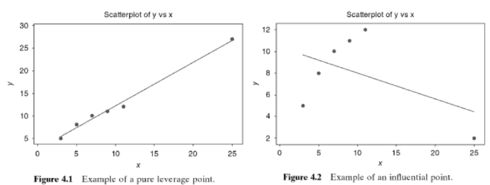

```{r echo=FALSE}
library(blogdown)
```

## Assumptions of Linear Regression

Linear Regression:

$$
\begin{align*}
Y_i = \beta_0 + \beta_1 X_{i1} + \dots + \beta_k X_{ik} + \epsilon_i
\end{align*}
$$


The major assumptions that we have made concerning Linear Regression are as follows:

1. Relationship between $Y$ and $X_i$ is linear
2. $E(\epsilon_i)=0$
3. $Var(\epsilon_i)=\sigma^2$
4. $Cov(\epsilon_i, \epsilon_j)=0$ for all $i \ne j$
5. $\epsilon_i {\overset {iid}{\sim}} N(0,\sigma^2)$

* If assumptions are violated, a different sample could lead to different model with opposite conclusions!
* All the inferences are based on the assumption that the model is correct.
* We cannot detect departure from underlying assumptions by examining standard summary statistics. $R^2$, $t$ or $F$ statistics are "global" model properties, and as such they do not ensure model adequacy

## Definition of Residuals

We previously learned that residuals are defined as:

$$
e_i = y_i - \hat{y_i}, \space i=1,2,...,n
$$
However there are a few other constructive ways to view the residuals:

* **deviation** between observed **data** and the **fitted** values
* **unexplained variability** in the response variable from the model
* **realized** or **observed values** of $\epsilon_i$

The residuals have several important properties:

* Zero mean or $\sum_{i=1}^n e_i =0$
* Approximate variance: 

$$
\frac{\sum_{i=1}^n (e_i - \overline{e_i})^2}{n-p} = \frac{\sum_{i=1}^n e_i^2}{n-p} = \frac{SS_{Res}}{n-p} = MS_{Res} = \hat{\sigma}^2
$$
where $p=$ # of parameters

* Unlike $\epsilon_i$, $e_i$ are not independent:
  * $n$ residuals have only $n-p$ degrees of freedom

**Scaled Residuals**: Helpful in finding **outliers**, the **unusual or extreme points** that are considerably different from other data points in $y$ or $x$ directions

## Standardized Residuals

Approximate average variance of a residual is estimated by $MS_{Res}$.

$$
d_i = \frac{e_i}{\sqrt{MS_{Res}}}
$$

* $d_i$s have mean zero and _approximate_ unit variance
* $\vert d_i \vert > 3$ may indicate an outlier

## Variance-Covariance of Residuals

Remember our definition of the Hat Matrix: 

$$
 \mathbf{H} = \mathbf{X} ( \mathbf{X^\intercal} \mathbf{X})^{-1} \mathbf{X^\intercal} 
$$

The Hat Matrix has the following properties:

* $\mathbf{H}$ is symmetric and idempotent
* $\mathbf{I-H}$ is symmetric and idempotent

Also remember that we can show residuals in matrix notation as:

$$
\mathbf{e} = \mathbf{y}-\mathbf{\hat{y}} = \mathbf{y} - \mathbf{X\hat{\beta}}=\mathbf{y}-\mathbf{Hy}=(\mathbf{I}-\mathbf{H})\mathbf{y}
$$
We can take that last equation, properties of the Hat matrix and substituting $\mathbf{y=X\beta+\epsilon}$ into:

$$
\begin{align*}
\mathbf{e} &= (\mathbf{I}-\mathbf{H})(\mathbf{X\beta+\epsilon})\\
&= \mathbf{X\beta}-\mathbf{HX\beta}+(\mathbf{I-H})\mathbf{\epsilon}\\
&= \mathbf{X\beta}-\mathbf{\mathbf{X} ( \mathbf{X^\intercal} \mathbf{X})^{-1} \mathbf{X^\intercal}}\mathbf{X\beta}+(\mathbf{I-H})\mathbf{\epsilon}\\
&= \mathbf{X\beta}-\mathbf{\mathbf{X} [( \mathbf{X^\intercal} \mathbf{X})^{-1} \mathbf{X^\intercal}}\mathbf{X}]\mathbf{\beta}+(\mathbf{I-H})\mathbf{\epsilon}\\
&= \mathbf{X\beta}-\mathbf{X} \mathbf{\beta}+(\mathbf{I-H})\mathbf{\epsilon}\\
&=(\mathbf{I-H})\mathbf{\epsilon}\\
\end{align*}\\
$$

Therefore we see that the residuals are the same linear transformation of the observations $\mathbf{y}$ and the errors $\mathbf{\epsilon}$, or in mathematical terms:

1. $\mathbf{e}=(\mathbf{I} - \mathbf{H})\mathbf{y}$
2. $\mathbf{e}=(\mathbf{I} - \mathbf{H})\mathbf{\epsilon}$

Using the second equation we can find the variance of $\mathbf{e}$

$$
\begin{align*}
Var(\mathbf{e}) &= Var[(\mathbf{I} - \mathbf{H})\mathbf{\epsilon}]\\
\end{align*}
$$
And leveraging the variance of matrices property: 
$$
Var(\mathbf{A}\mathbf{X}) = \mathbf{A}(Var(\mathbf{X}))\mathbf{A^\intercal}
$$ 

Where:

* $\mathbf{X} \in \mathbb{R}^{\ell \times 1}$ is a random column vector 
* $\mathbf{A} \in \mathbb{R}^{k \times \ell}$ is a constant matrix

So back to our variance:

$$
\begin{align*}
Var(\mathbf{e}) &= Var[(\mathbf{I} - \mathbf{H})\mathbf{\epsilon}]\\
&= (\mathbf{I} - \mathbf{H}) Var(\mathbf{\epsilon}) (\mathbf{I} - \mathbf{H}) ^\intercal\\
&= \sigma^2 (\mathbf{I} - \mathbf{H})
\end{align*}
$$

Since the $Var(\mathbf{\epsilon})=\sigma^2 \mathbf{I}$ and $\mathbf{I}-\mathbf{H}$ is symmetric and idempotent. The matrix $\mathbf{I}-\mathbf{H}$ is generally not diagonal, so the residuals have different variances and they are correlated:

* $Var(e_i) = \sigma^2(1-h_{ii})$, where $h_{ii}$ is the $i$-th diagonal element of $\mathbf{H}$
* $Cov(e_i,e_j) = -\sigma^2h_{ij}$, where $h_{ij}$ is the $ij$-th diagonal element of $\mathbf{H}$

* $h_{ii} \in [0,1]$ measures the location of the $i$-th point in $\mathbf{x}$ space

  * the __smaller__ $h_{ii}$ is:
    * The __larger__ the $Var(e_i)$
    * The __closer__ the point $\mathbf{x_i}$ lies to the centroid of the $\mathbf{X}$ space
  * The __larger__ $h_{ii}$ is:
    * The __smaller__ the $Var(e_i)$
  * $MS_{res}>MS_{res}(1-h_{ii})$ overestimates $Var(e_i)$

### Leverage Points and Influential Points

* **Leverage Point** - Leverage points are observations made at extreme values of the independent variables; the lack of neighboring observations means that the fitted regression model will pass close to that particular observation.
* **Influential Point** - Influential observations are those observations that have a relatively large effect on the regression model's predictions
    * Drags the prediction to itself
    * Remote point with large $h_{ii}$ may be influential
* **Leverage vs. Influential** - An influential point will typically have high leverage; however a high leverage point is not necessarily an influential point.

### Influential Points - Mathematical Insights

* Let $y_n$ be the observed response for the $n^{th}$ data point
* Let $\hat{y}_n^*$ be predicted value for response based on other n-1 data points
* Let $\delta = y_n - \hat{y}_n^*$ or the difference between actual observed value vs. predicted value from "other" observations.


_Model Adequacy Checking - Introduction to Linear Regression Analysis - 5th addition - Montgomery/Peck/Vining_

Using the an image from Introduction to Linear Regression Analysis by Montgomery/Peck/Vining

For $x=25$:

* Figure 1: $\hat{y}_n^* = 25$ predicted value based on other points
* Figure 2: $y_n=2$ actual value
* $\delta = y_n - \hat{y}_n^*$ is -23: showing very influential point

Furthermore if the $n^{th}$ data point is remote in terms of the space devined by data values for regressors, then $h_{nn}$ approaches 1 and $\hat{y}_n$ approaches $y_n$

$$
\begin{align*}
\hat{y}_n&=\hat{y}_n^* + h_{nn}\delta\\
&=\hat{y}_n^* + \left [ \frac{1}{n} + \left ( \frac{n-1}{n} \right )^2 \frac{(x_n-\overline{x}^*)^2}{S_{xx}} \right ]\delta\\
\end{align*}
$$

Let $\overline{x}^*$ be the average value for the other $n$-1 regressors.


## Studentized Residuals

A logical next step is to produce a residual with constant variance:

$$
r_i = \frac{e_i}{\sqrt{MS_{res}(1-h_{ii})}}
$$

* $r_i$s have mean zero and unit variance, regardless of the location of $\mathbf{x_i}$ when the model form is correct
* Larger than $d_i$
* When $n$ is large, standardized $d_i$ and studentized $r_i$ are similar

#### Practice: If there is only one regressor, show that studentized residuals are:

$$
r_i = \frac{e_i}
{\sqrt{MS_{res}    \left [ 1- \left ( \frac{1}{n} + \frac{(x_i - \overline{x})^2}{S_{xx}} \right ) \right ]         }                 }
$$

## PRESS Residuals

Another alternative is to find $\hat{y}_{(i)}$: the fitted value of $y_i$ based on a model with all observations except $y_i$

Define the prediction residual as:

$$
e_{(i)}=y_i - \hat{y}_{(i)}
$$

#### Motivation:

* If the $i$-th point $(\mathbf{x_i}, y_i)$ is unusual it can "overly" influence the regression model
* If the point in question is used then $y_i \approx \hat{y}_{(i)}$ and it's hard to detect an outlier
* If the point in question is not used then $\hat{y}_{(i)}$ cannot be influenced by it, and the residual will better reflect how unusual the point is

#### Practice: It can be shown

$$
e_{(i)} = \frac{e_i}{1-h_{ii}}, \space i=1,2,\dots,n
$$

* When $h_{ii}$ is large, the PRESS residual is large, or the difference between $e_i$ and $e_{(i)} is large$
* These points will generally be **high influence** points
* $(\mathbf{x_i},y_i)$ is a point where the model **fits** the data well, but a model built without the point **predicts** poorly


#### The Sum of Squares becomes:
(i.e. **PR**ediction **E**ror **S**um of **S**quares **(PRESS)**):


$$
\sum_{i=1}^n e_i = \sum_{i=1}^n \left ( y_i - \hat{y}_{(i)} \right )^2
$$


### Standardized PRESS Residuals

The variance of the $i$th PRESS residual is:

$$
Var[e_{(i)}]=Var \left [ \frac{e_i}{1-h_{ii}} \right ] = \frac{\sigma^2}{1-h_{ii}}
$$

so that a **standardized** PRESS residual is:

$$
\frac{e_{(i)}}{\sqrt{Var(e_{(i)}})} = \frac{e_{i}/(1-h_{ii})}{\sqrt{\sigma^2/(1 - h_{ii})}} = \frac{e_{i}}{\sqrt{\sigma^2(1 - h_{ii})}}
$$

which, if we use $MS_{Res}$ to estimate $\sigma^2$, is just the **studentized residual** discussed previously.

## PRESS Statistic

Sum of squared PRESS residuals, as a measure of model quality:

$$
\begin{align*}
PRESS &= \sum_{i=1}^n [y_i - \hat{y_{(i)}}]^2\\
&= \sum_{i=1}^n \left ( \frac{e_i}{1 - h_{ii}} \right )^2
\end{align*}
$$

## R-Student Residuals

* $MS_{res}$ uses all $n$ observations to estimate $\sigma^2$
* $S_{(i)}^2$ estimates $\sigma^2$ based on the data with the $i$-th observation removed:

$$
S_{(i)}^2 = \frac{(n-p)MS_{res}-e_i^2/(1-h_{ii})}{n-p-1}
$$

### R-Student residual:

$$
t_i = \frac{e_i}{\sqrt{S_{(i)}^2(1-h_{ii})}}
$$

* If $i$-th observation is influential, $S_{(i)}^2$ is significantly different from $MS_{res}$

## Residual Plots

Normal probability ([QQ-plot](https://en.wikipedia.org/wiki/Q%E2%80%93Q_plot)) of residuals:

* $t_{test}$, $F_{test}$, CI and PI all depend on normality assumptions
* Heavy tailed error distributions often generate outliers that "pull" the LS fit too much in their direction

Plot $e_i$ vs. fitted values $\hat{y}_i$
* Check for nonconstant variance
* Check for nonlinearity
* Look for outliers
* We plot $e_i$ vs. fitted values $\hat{y}_i$ as $e_i$ and $y_i$ are usually correlated
**Why?**

### Other Residual Plots

#### $e_i$ vs. $x_j$

* Similar to $e_i$ to $\hat{y}_i$
* Not always effective revealing whether a transformation is required

#### Partial Regression Plot

* Study **marginal** effect of a $x_j$ given all others in the model
* Evaluate whether we specified the relationship between $y$ and $x_j$ correctly

##### Partial Regression Plot - How

1. Regress $y$ on all regressors except $x_j$ and obtain residuals

$$
\begin{align*}
\hat{y}_i(x_{(j)})&= b_0 + b_1 x_{i1} + \dots + b_{j-1}x_{i,j-1} + b_{j+1}x_{i,j+1} + \dots + b_{k}x_{ik}\\
e_i(y|x_{(j)})&= y_i - \hat{y}_{i}(x_{(j)})
\end{align*}
$$
  
2. Regress $x_j$ on all other predictors and obtain residuals


$$
\begin{align*}
\hat{x}_j(x_{(j)})&= a_0 + a_1 x_{i1} + \dots + a_{j-1}x_{i,j-1} + a_{j+1}x_{i,j+1} + \dots + a_{k}x_{ik}\\
e_i(x_j|x_{(j)}) &= x_{ij} - \hat{x}_{ij}(x_{(j)})
\end{align*}
$$

3. Plot $e_i(y|x_{(j)})$ vs. $e_i(x_j|x_{(j)})$

* If the plot of $e_i(y|x_{(j)})$ vs. $e_i(x_j|x_{(j)})$ is linear, then a linear relationship between $y$ and $x_j$ seems reasonable
* The slope of the line will be the regression coefficient of $x_j$ in an MLR model
* If the plot is curvilinear, we may need some transformation such as $x_j^2$ or $1/x_j$
* If $x_j$ is a candidate variable, a horizontal band indicates there is no additional useful information in $x_j$ for predicting $y$