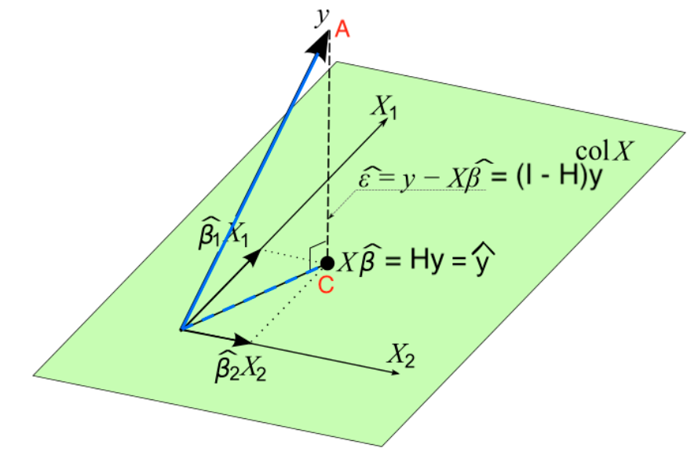

```{r echo=FALSE}
library(blogdown)
```
$y=\beta_0 + \beta_1 x$

$e_i = y_i - \hat{y_i} = y_i - (b_0 + b_i x_i)$

$SS_{res} = \sum_{i=1}^n e_i^2= \sum_{i=1}^n (y_i - b_0 + b_1 x_i)^2$

$\frac{\partial SS_{res}}{\partial {\beta_0}} \bigg\vert_{b_0,b_1} = -2\sum_{i=1}^n(y_i-b_0-b_1x_i)$

$\frac{\partial SS_{res}}{\partial {\beta_1}} \bigg\vert_{b_0,b_1} = -2\sum_{i=1}^nx_i(y_i-b_0-b_1x_i)$

$b_0 = \overline{y} - b_1 \overline {x}$

$b_1 = \frac{\sum_{i=1}^ny_i(x_i - \overline{x})}{\sum_{i=1}^nx_i(x_i -\overline{x})}  =\frac{\sum_{i=1}^n(x_i - \overline{x})(y_i-\overline{y})}{\sum_{i=1}^n(x_i-\overline{x})^2}=\frac{S_{xy}}{S_{xx}}$

$Var(b_1) = \sigma^2 \sum_{i=1}^n c_i^2 = \frac {\sigma^2 \sum_{i=1}^n (x_i-\overline {x})^2}{S_{xx}^2} = \frac{\sigma^2}{S_{xx}}$

$Var(b_0) = \sigma^2 \left ( \frac{1}{n} + \frac{\overline{x}^2}{S_{xx}} \right )$

$E(b_0) = \beta_0; E(b_1)=\beta_1$

$\sum_{i=1}^n(y_i - \hat {y_i}) = \sum_{i=1}^n e_i = 0$

$\sum_{i=1}^ny_i = \sum_{i=1}^n \hat{y}$

LRM contains centroid $(\overline{x},\overline{y})$

$\sum_{i=1}^n e_i x_i = 0$

$\sum_{i=1}^n e_i \hat{y_i} = 0$

$\hat{\sigma}^2 = \frac {SS_{Res}}{n-2}=MS_{Res}$

$\beta_1$: $b_1 \pm t_{\alpha/2,n-2} \sqrt{\hat{\sigma}^2/S_{xx}}$

$\beta_0$: $b_0 \pm t_{\alpha/2,n-2} \sqrt{\hat{\sigma}^2 (1/n + \overline{x}^2/S_{xx})}$

$\hat{\sigma^2} = MS_{res} \sim \sigma^2 \frac {\chi_{n-2}^2}{n-2}$

$\hat{\sigma^2} \space \text{range} \space  (\frac{SS_{Res}}{\chi_{\alpha/2,n-2}^2},\frac{SS_{Res}}{\chi_{1-\alpha/2,n-2}^2})$

$se(\hat{\beta_1}) = \sqrt{\frac{MS_{Res}}{S_{xx}}}$

$se(\hat{\beta_0}) = \sqrt{MS_{Res} (1/n + \overline{x}^2/S_{xx})}$

Reject $H_0$ in favor of $H_1$ 

if Critical Value Method: $\vert t_{test} \vert > t_{\alpha/2,n-2}$

P-Value Method: p-value = $2P(t_{n-2} > \vert t_{test} \vert ) < \alpha$

Test statistic: $t_{test} = \frac {b_1 - \beta_1^0}{se(b_1)} \sim t_{n-2}$ under $H_0$

Test statistic: $t_{test} = \frac {b_0 - \beta_0^0}{se(b_0)} \sim t_{n-2}$ under $H_0$


$(SS_T)$ : $\sum_{i=1}^n (y_i - \overline{y})^2$

$(SS_R)$: $\sum_{i=1}^n (\hat{y_i} - \overline{y})^2$ or $\hat{\beta_1}S_{xy}$

$(SS_{Res})$: $\sum_{i=1}^n (y_i - \hat{y_i})^2$ or $SS_T - \hat{\beta_1}S_{xy}$

$F_{test}=\frac {SS_R/df_R}{SS_{Res}/df_{Res}}=\frac{SS_R/1}{SS_{Res}/{(n-2)}}=\frac{MS_R}{MS_{Res}}$

reject $H_0$ if $F_{test} > F_{\alpha,1,n-2}$ or p-value = $P(F_{1,n-2} > F_{test}) > \alpha$

$R^2 = \frac {SS_R}{SS_T}= \frac {SS_T - SS_{Res}}{SS_T} = 1-\frac {SS_{Res}}{SS_T}$

$\hat{\mu_{y|x_0}} \pm t_{\alpha/2,n-2} \hat{\sigma} \sqrt{\frac{1}{n}+\frac{(x_0-\overline{x})^2}{S_{xx}}}$

$\hat{y_0} \pm t_{\alpha/2,n-2} \hat{\sigma} \sqrt{1 + \frac{1}{n}+\frac{(x_0-\overline{x})^2}{S_{xx}}}$

$f(y_i|\beta_0,\beta_1,\sigma^2) = \frac{e^{\frac{-(y_i-\beta_0-\beta_i x_i)^2}{2\sigma^2}}}{\sqrt{2 \pi \sigma^2}}$

$L(\beta_0,\beta_1,\sigma^2|Y_i) = \prod_{i=1}^n e^{\frac{-(y_i-\beta_0-\beta_i x_i)^2}{2\sigma^2}}\left ( \frac{1}{\sqrt{2 \pi \sigma^2}} \right )^n$

$l(\beta_0,\beta_1,\sigma^2|Y_i) = \frac{-1}{2\sigma^2}\sum_{i=1}^n(y_i-\beta_0-\beta_i x_i)^2 - \frac {n}{2} ln(2 \pi ) - \frac {n}{2} ln(\sigma^2 )$

$\frac{\partial l} {\partial {\beta_0}} \bigg\vert_{\hat{\beta_0},\hat{\beta_1},\hat{\sigma}} = \frac{1}{\hat{\sigma}^2}\sum_{i=1}^n (y_i-\hat{\beta_0}-\hat{\beta}_1x_i) = 0$ 


$\frac{\partial l}{\partial {\beta_1}} \bigg\vert_{\hat{\beta_0},\hat{\beta_1},\hat{\sigma}} = \frac{1}{\hat{\sigma}^2} \sum_{i=1}^n (y_i-\hat{\beta}_0-\hat{\beta}_1x_i)x_i = 0$

$\frac{\partial l}{\partial {\sigma^2}} \bigg\vert_{\hat{\beta_0},\hat{\beta_1},\hat{\sigma}} =
-\frac{1}{2\hat{\sigma}^2} + \frac{1}{2\hat{\sigma}^4}  \sum_{i=1}^n (y_i-\hat{\beta}_0-\hat{\beta}_1x_i)^2 = 0$


$\hat{\beta_0} = \overline{y} - \hat{\beta_1} \overline {x}=b_0$

$\hat{\beta_1} =\frac{\sum_{i=1}^n(x_i - \overline{x})y_i}{\sum_{i=1}^n(x_i -\overline{x})^2} = b_1$

$\hat{\sigma^2} =\frac{\sum_{i=1}^n(y_i - \hat{\beta_0} - \hat{\beta_1}x_i)^2}{n}$

$Y_i = \beta_0 + \beta_1 X_{i1} + \dots + \beta_k X_{ik} + \epsilon_i$

$y_i= \beta_0 + \sum_{j=1}^k\beta_j x_{ij} + \epsilon_i,\quad i=1,2,\dots,n$

$S(\beta_0, \beta_1,\dots,\beta_k) = \sum_{i=1}^n \epsilon_i^2 = \sum_{i=1}^n \left ( y_i - \beta_0 - \sum_{j=1}^k \beta_j x_{ij} \right )^2$

$\frac{\partial S}{\partial {\beta_0}} \bigg\vert_{b_0,b_1,\dots,b_k} = -2\sum_{i=1}^n ( y_i - b_0 -\sum_{j=1}^k b_j x_{ij} ) = 0$

$\frac{\partial S}{\partial {\beta_j}} \bigg\vert_{b_0,b_1,\dots,b_k} = -2\sum_{i=1}^n \left ( y_i-b_0-\sum_{j=1}^k b_j x_{ij} \right ) x_{ij} = 0$

$\mathbf{y} = \mathbf{X} \mathbf{\beta} + \mathbf{\epsilon} \space, \mathbf{y} = \begin{bmatrix}y_1\\y_2\\\vdots\\y_n\end{bmatrix}$

$\mathbf{X} = \begin{bmatrix}1 & x_{11} & x_{12} & \dots & x_{1k}\\1 & x_{21} & x_{22} & \dots &x_{2k}\\ \vdots & \vdots & \vdots & \ddots & \vdots\\1 & x_{n1} & x_{n2} & \dots & x_{nk}\\\end{bmatrix}$

$\mathbf{\beta} = \begin{bmatrix} \beta_0\\ \beta_1\\ \vdots\\ \beta_k \end{bmatrix}, \space \mathbf{\epsilon} =  \begin{bmatrix} \epsilon_1\\ \epsilon_2\\ \vdots\\ \epsilon_n \end{bmatrix}$

$\mathbf{X}$: Design matrix $\mathbf{\epsilon} \sim N(\mathbf{0},\sigma^2 \mathbf{I})$

$S(\mathbf{\beta}) =\mathbf{y}^\intercal\mathbf{y}-2\mathbf{\beta^\intercal}\mathbf{X}^\intercal\mathbf{y}+\mathbf{\beta^\intercal}\mathbf{X^\intercal}\mathbf{X}\mathbf{\beta}$

$\frac{\partial{\mathbf{t}^\intercal} \mathbf{a}}{\partial{t}} = \frac{\partial{\mathbf{a}^\intercal} \mathbf{t}}{\partial{t}} = \mathbf{a}$

$\frac{\partial{\mathbf{t}^\intercal} \mathbf{A} \mathbf{t}}{\partial{t}} = 2 \mathbf{A}\mathbf{t}$

$\frac{\partial{S}}{\partial\beta}\bigg\vert_{\mathbf{b}} = -2 \mathbf{X^\intercal} \mathbf{y} + 2 \mathbf{X^\intercal} \mathbf{X} \mathbf{b} = 0$

$\mathbf{b} = ( \mathbf{X}^\intercal \mathbf{X}) ^ {-1} \mathbf{X}^\intercal \mathbf{y}$

$\mathbf{\hat{y}} = \mathbf{X} \mathbf{b} = \mathbf{X} ( \mathbf{X^\intercal} \mathbf{X})^{-1} \mathbf{X^\intercal} \mathbf{y} = \mathbf{H} \mathbf{y}$

**hat matrix** $\mathbf{X} ( \mathbf{X^\intercal} \mathbf{X})^{-1} \mathbf{X^\intercal}$

$\mathbf{e} = \mathbf{y}-\mathbf{\hat{y}} = \mathbf{y} - \mathbf{Xb} = \mathbf{y}-\mathbf{Hy}=(\mathbf{I}-\mathbf{H})\mathbf{y}$

* Both $\mathbf{H}$ and $\mathbf{I-H}$ are __symmetric__ and __idempotent__ **projection** matrices

* $\mathbf{H}$ projects $\mathbf{y}$ to $\mathbf{\hat{y}}$ on column space of $\mathbf{X}$, $Col(\mathbf{X})$
* $\mathbf{I-H}$ projects $\mathbf{y}$ to $\mathbf{e}$ on the space **perpendicular** to $Col(\mathbf{x})$, or $Col(X)^\bot$

* $Col(\mathbf{X}) = \{ \mathbf{X}\mathbf{b}: \mathbf{b} \in \mathbf{R}^p \}$
* $\mathbf{y} \notin Col(\mathbf{X})$
* $\hat{\mathbf{y}} = \mathbf{Xb} = \mathbf{Hy} \in Col(\mathbf{X})$
* Minimize the distance of $\textcolor{red}{A}$ to $Col(\mathbf{X})$: Find the point in $Col(\mathbf{X})$ that is closest to $\textcolor{red}{A}$...that is $\textcolor{red}{C}$  
* Distance is minimized when the point in spaces is the foot of the line from $\textcolor{red}{A}$ **normal** to the space. That is point $\textcolor{red}{C}$
* $\mathbf{e} = \mathbf{y}-\mathbf{\hat{y}} = \mathbf{y} - \mathbf{Xb} = \mathbf{y}-\mathbf{Hy}=(\mathbf{I}-\mathbf{H})\mathbf{y} \bot Col(\mathbf{X})$
* $\mathbf{X^\intercal} (\mathbf{y} - \mathbf{Xb})=0$
* Searching for the LS solution **b** that minimizes $SS_{Res}$ is the same as locatin the point $\mathbf{Xb} \in Col(\mathbf{X})$ that is as clost to $\mathbf{y}$ as possible!



$Var(\mathbf{b})=\sigma^2(\mathbf{X}^\intercal \mathbf{X})^{-1}$


$$
\begin{align*}
SS_{Res}=  \mathbf{y^\intercal y} - 2\mathbf{b^\intercal X^\intercal y} +  \mathbf{b^\intercal X^\intercal  X b}
\end{align*}
$$

However, since $\mathbf{X^\intercal X b} = \mathbf{X^\intercal y}$  we can clean up. Additionally looking at the relationship between $MS_{res}$ and $SS_{res}$:

$$
\begin{align}
SS_{Res} &=  \mathbf{y^\intercal y} - \mathbf{b^\intercal X^\intercal y}\\
MS_{Res} &= \frac{SS_{Res}}{n-p} \space \space \text{with} \space p=k+1
\end{align}
$$

* $\hat{\sigma^2}=MS_{Res}$ is an unbiased estimator for $\sigma^2$, i.e. $E[MS_{Res}] = \sigma^2$
* $\hat{\sigma^2}$ of SLR may be larger than the $\hat{\sigma^2}$ of MLR.
* $\hat{\sigma^2}$ measures the variation of the _unexplained_ noise about the fitted regression line/hyperplane, so we prefer a small residual mean square.

### Test for Significance of Regression

Test for significance: Determine if there is a **linear** relationship between the response and **andy** of the regressor varaibles.

* $H_0: \beta_1 = \beta_2 = \cdots = \beta_k = 0$ 
* $H_1: \beta_j \ne 0$ for at least one $j$

* $F_{test} > F_{\alpha,1,n-2}$
* p-value = $P(F_{1,n-2} > F_{test}) > \alpha$

Combining all these definitions we have...


```{r echo=FALSE, results='asis', escape=FALSE}
x <- data.frame("Source of Variation" = c("Regression","Residual","Total"),
                "Sum of Squares" = c("$SS_R$","$SS_{Res}$","$SS_T$"),
                "Degrees of Freedom" = c("k", "n-k-1", "n-1"),
                "Mean Square" = c("$MS_R$", "$MS_{Res}$",""),
                "$F_0$" = c("$MS_R/MS_{Res}$", "","")
                )
knitr::kable(x=x,caption = "ANOVA Table",format="markdown", escape=FALSE, col.names=c("Source of Variation","Sum of Squares","Degrees of Freedom","Mean Square","$F_{test}$"))

```
* _Note: k is # of coefficients for regressors. For SLR k = 1_

We have determined $SS_{Res}$ in equation $\textcolor{red}{(6)}$ from above. So let's look at how we can find $SS_T$

$$
\begin{align*}
SS_T &= \sum_{i=1}^n (y_i - \overline{y})^2\\
&= \sum_{i=1}^n y_i^2 + \sum_{i=1}^n -2y_i\overline{y} + \sum_{i=1}^n \overline{y}^2\\
&= \sum_{i=1}^n y_i^2 + -2 \overline{y} \sum_{i=1}^n y_i + \overline{y}^2 \sum_{i=1}^n 1\\
\end{align*}
$$

Now we leverage a relationship: $\sum_{i=1}^n y_i = n \overline{y}$ to adjust the second term and cleaning up the last term whereby $\sum_{i=1}^n 1 = n$:

$$
\begin{align*}
SS_T &= \sum_{i=1}^n y_i^2 + -2 \overline{y} n \overline{y} + \overline{y}^2 n\\
&= \sum_{i=1}^n y_i^2 + -2 n \overline{y}^2 + n \overline{y}^2\\
&= \sum_{i=1}^n y_i^2 + - n \overline{y}^2\\
\end{align*}
$$
We make two more substitution: $\overline{y} = \frac{1}{n}\sum_{i=1}^n y_i$ and the fact that $\sum_{i=1}^n y_i^2 = \mathbf{y^\intercal y}$

$$
\begin{align*}
SS_T &= \mathbf{y^\intercal y} + - n \left ( \frac{1}{n} \sum_{i=1}^n y_i\right )^2\\
&= \mathbf{y^\intercal y} + - \frac{n}{n^2} \sum_{i=1}^n y_i^2\\
&= \mathbf{y^\intercal y} - \frac{1}{n} \sum_{i=1}^n y_i^2\\
\end{align*}
$$

* $SS_T = \mathbf{y^\intercal y} - \frac{1}{n} \sum_{i=1}^n y_i^2$
* $SS_{Res} =  \mathbf{y^\intercal y} - \mathbf{b^\intercal X^\intercal y}$
* $SS_R = SS_T - SS_{Res} = \mathbf{b^\intercal X^\intercal y} - \frac{1}{n} \sum_{i=1}^n y_i^2$
* Reject $H_0$ if $F_{test} > F_{\alpha,k,n-k-1}$
* $E[MS_{Res}] = \sigma^2$
* $E[MS_R] = \sigma^2 + \frac{\beta_{1:k}^\intercal \mathbf{X_c ^\intercal X_c \beta_{1:k}}}{k\sigma^2}$ where $\beta_{1:k}=(\beta_1,\dots,\beta_k)^\intercal$ 
* $\mathbf{X_c} = 
\begin{bmatrix}
x_{11} - \overline{x_1} & x_{12} - \overline{x_2} & \dots & x_{1k}- \overline{x_k}\\
x_{21} - \overline{x_1} & x_{22} - \overline{x_2} & \dots & x_{2k}- \overline{x_k}\\
\vdots & \vdots &  \ddots & \vdots\\
x_{n1} - \overline{x_1} & x_{n2} - \overline{x_2} & \dots & x_{nk}- \overline{x_k}\\
\end{bmatrix}$

### $R^2$ and Adjusted $R^2$

#### $R^2$
* Calculated the same as SLR
$$
R^2 = \frac {SS_R}{SS_T}= \frac {SS_T - SS_{Res}}{SS_T} = 1-\frac {SS_{Res}}{SS_T}
$$
* The model with one additional predictor always gets a higher $R^2$
* Measures the proportion of variability in $Y$ that is explained by the regression model or the $k$ predictors

#### Adjusted $R^2$
$$
R_{adj}^2 = 1-\frac {SS_{Res}/(n-p)}{SS_T/(n-1)}
$$

* Applies a penalty (through p) for the number of variables included in the model

### Test on Individual Regression Coefficients

#### Partial/Marginal Test

* Tests the contribution of $X_j$ given all other regressors in the model
* $H_0:\beta_j = 0$ and $H_1: \beta_j \ne 0$
* $t_{test} = \frac{b_j}{\sqrt{\hat\sigma^2 C_{jj}}}$, where $C_{jj}$ is the $j$-th diagonal element of $(\mathbf{X^\intercal X})^{-1}$
* Reject $H_0$ if $\vert t_{test} \vert \gt t_{\alpha/2,n-k-1}$

#### Reduced Model vs. Full Model

* Overall test of significance: _all_ predictors vs. Marginal $t$-test: _one single_ predictor
* Test any subset
* **Full**: $y=\beta_0+\beta_1 x_1 + \beta_2 x_2 + \beta_3 x_3 + \beta_4 x_4 + \epsilon$
* $H_0: \beta_2 = \beta_4 = 0$
* **Reduced** (under $H_0$): $y=\beta_0+\beta_1 x_1 + \beta_3 x_3 + \epsilon$
* Like to see if $x_2$ and $X_4$ contribute to model when $x_1$ and $x_3$ are in model
  - If yes, $\beta_2 \ne 0$ and/or $\beta_4 \ne 0$ (Reject $H_0$)
  - Otherwise, $\beta_2=\beta_4=0$ (Do not reject $H_0$)
