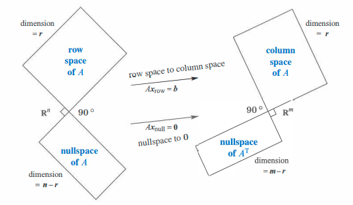
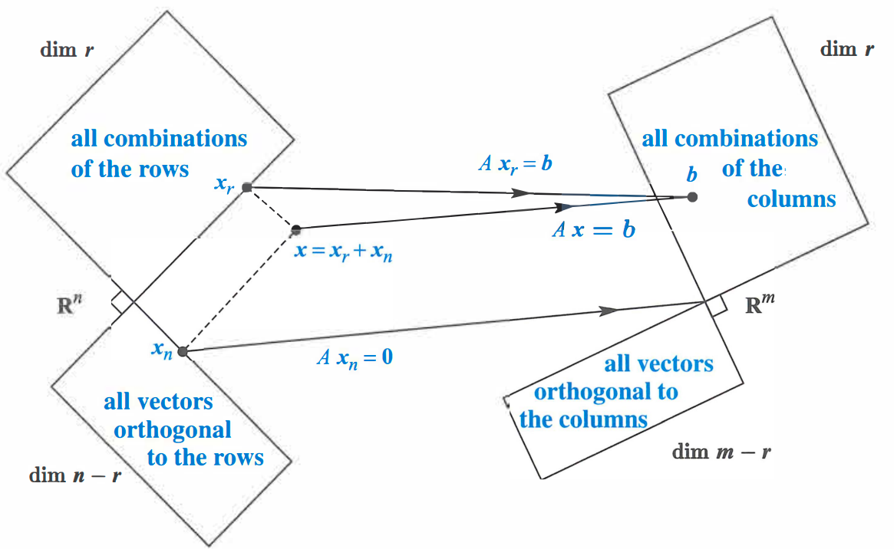

The following are my personal notes from taking the online class: [Introduction to Linear Algebra - MIT OCW 18.06](https://ocw.mit.edu/courses/mathematics/18-06-linear-algebra-spring-2010/index.htm)

## 4.1 Orthogonality of the Four Subspaces

- Orthogonal vectors: $\mathbf{v}^{\intercal}\mathbf{w}=0$
- $\Vert \mathbf{v} \Vert ^{2} + \Vert \mathbf{w} \Vert ^{2} = \Vert \mathbf{v} + \mathbf{w} \Vert ^{2}$
- Orthogonal subspaces: Two subspaces $V$ and $W$ are orthogonal if $\mathbf{v}^{\intercal}\mathbf{w}=0; \; \forall \mathbf{v} \in V \; and \; \forall \mathbf{w} \in W$
- Every vector \mathbf{x} in the nullspace is perpendicualr to every row of $A$, because $A\mathbf{x}=\mathbf{0}$
- The nullspace $\mathbf{N}(A)$ and the row space $\mathbf{C}(A)$ are orthogonal subspaces of $\R^n$
- nullspace $\mathbf{N}(A)$ and the row space $\mathbf{C}(A)$ relationship: 
$$
A\mathbf{x} =
\begin{bmatrix}
\mathbf{row\;1}\\
\vdots\\
\mathbf{row\;m}\\
\end{bmatrix}
\begin{bmatrix}\\
\mathbf{x}\\
\\
\end{bmatrix}
=
\begin{bmatrix}
0\\
\vdots
\\
0
\end{bmatrix}
\begin{matrix}
\longleftarrow
\\
\\
\longleftarrow
\end{matrix}
\begin{matrix}
(\mathbf{row\;1})\cdot  x \; \text{is zero}\\
\\
(\mathbf{row\;m})\cdot  x \; \text{is zero}\\
\end{matrix}
$$
- Nullspace orthogonal to row space proof: $\mathbf{x}^{\intercal}(A^{\intercal}\mathbf{y}) = (A\mathbf{x})^{\intercal} \mathbf{y} = \mathbf{0}^{\intercal}\mathbf{y}=0$
- Every vector $\mathbf{y}$ in the nullspace of $A^{\intercal}$ is perpendicular to every column of $A$
- The left nullspace $\mathbf{N}(A^{\intercal})$ and the column space $\mathbf{C}(A)$ are orthogonal in $\R^n$
- $\mathbf{C}(A)\perp\mathbf{N}(A^{\intercal})$

$$
A^{\intercal}\mathbf{y} =
\begin{bmatrix}
(\mathbf{column\;1})^{\intercal}\\
\vdots\\
(\mathbf{column\;n})^{\intercal}\\
\end{bmatrix}
\begin{bmatrix}\\
\mathbf{y}\\
\\
\end{bmatrix}
=
\begin{bmatrix}
0\\
\vdots
\\
0
\end{bmatrix}
$$

- Fundamental Theorem of Linear Algebra Part 2: 
  1. $\mathbf{N}(A)$ is the orthogonal complement of the row space $\mathbf{C}(A^{\intercal})$ in $\R^n$
  2. $\mathbf{N}(A^{\intercal})$ is the orthogonal complement of the column space $\mathbf{C}(A})$ in $\R^m$
- Any $n$ independent vectors in $\R^n$ must span $\R^n$. So they are a basis
- Any $n$ vectors that span $\R^n$ must be independent. So they are a basis.
- If the $n$ columns of $A$ are independent, they span $\R^n$. So $A\mathbf{x}=\mathbf{b}$ is solvable.
- If the $n$ columns span $\R^n$, they are independent. So $A\mathbf{x}=\mathbf{b}$ has only one solution.

{width=150%}

{width=130%}

## 4.2 Projections

## 4.3 Least Squares Approximations

## 4.4 Orthonormal Bases and Gram-Schmidt