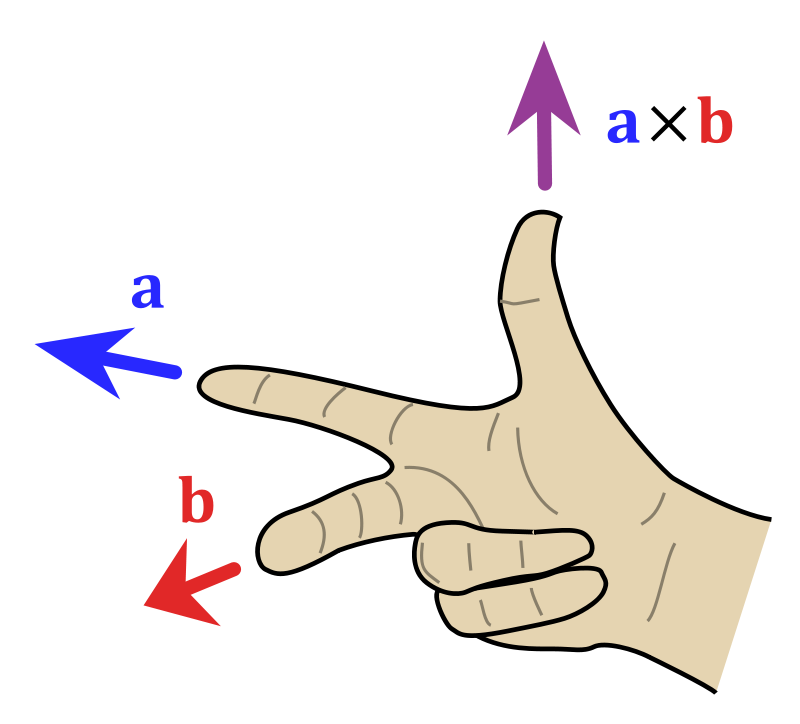

## Notation and Simple Matrix Algebra

- n: number of observations
- $x_{ij}$: the $j$-th variable of the $i$th observation where $i=1,2,\dots,n$ and $j=1,2,\dots,p$
- p: number of variables
- $\mathbf{X}$: is a matrix of size $n \times p$ whose $(i,j)$th element is $x_{ij}$
- $\mathbf{X}=$ $\begin{pmatrix} x_{11}&x_{12}&\dots&x_{1p} \\x_{21}&x_{22}&\dots&x_{2p}\\\vdots&\vdots&\ddots&\vdots\\x_{n1}&x_{n2}&\dots&x_{np} \end{pmatrix}$
- Row vector of $\mathbf{X}$: $x_i = \begin{pmatrix} x_{i1}\\x_{i2}\\\vdots\\x_{ip} \end{pmatrix}$; 
  - *Note: even though it is a __row__ vector the default orientation is as a column
- Column vector of $\mathbf{X}$: $\mathbf{x}_j = \begin{pmatrix} x_{1j}\\x_{2j}\\\vdots\\x_{nj} \end{pmatrix}$
- With these row and column conventions the entire matrix $\mathbf{X}$ can be written as:
  - Using Column Vectors: $\mathbf{X}=\begin{pmatrix} \mathbf{x}_1 & \mathbf{x}_2 & \dots & \mathbf{x}_p  \end{pmatrix}$
  - Using Row Vectors: $\mathbf{X} = \begin{pmatrix} x^{\intercal}_{1}\\x^{\intercal}_{2}\\\vdots\\x^{\intercal}_{n} \end{pmatrix}$
- order: refers to the number of rows and columns of a matrix
- rank of matrix: the number of linearly independent rows/columns or with a "transformation" lense it is the number of dimensions in the output or column space
- column rank: the number of linearly independent columns
- row rank: the number of linearly independent rows
- Matrix $\mathbf{A}$ is full rank: if $\text{rank}(\mathbf{A})=min(n,p)$
- full rank if $n<p$: implies full row rank $\text{rank}(\mathbf{A})=n$
- full rank if $n>p$: implies full column rank $\text{rank}(\mathbf{A})=p$

- $\intercal$: transpose of a matrix
- $\mathbf{X}^{\intercal}=$ $\begin{pmatrix} x_{11}&x_{21}&\dots&x_{n1} \\x_{12}&x_{22}&\dots&x_{n2}\\\vdots&\vdots&\ddots&\vdots\\x_{1p}&x_{2p}&\dots&x_{np} \end{pmatrix}$
- $x_i^{\intercal} = \begin{pmatrix} x_{i1}&x_{i2}&\dots&x_{ip} \end{pmatrix}$
- $(\mathbf{A}^\intercal)^\intercal=\mathbf{A}$
- $(\mathbf{A}+\mathbf{B})^\intercal=\mathbf{A}^\intercal+\mathbf{B}^\intercal$
- $(b\mathbf{A})^\intercal=b\mathbf{A}^\intercal$ where $b$ is a scalar
- $(\mathbf{A}\mathbf{B})^\intercal=\mathbf{B}^\intercal\mathbf{A}^\intercal$
- $(\mathbf{A}^{-1})^\intercal=(\mathbf{A}^\intercal)^{-1}$
- trace of a square matrix $\mathbf{A}$ is the sum of the diagonals or 
$$\text{tr}(\mathbf{A})=\sum_{j=1}^p a_{jj}$$
- $\text{tr}(\mathbf{A})=\text{tr}(\mathbf{A}^\intercal)$
- $\text{tr}(\mathbf{A}+ \mathbf{B})=\text{tr}(\mathbf{A}) + \text{tr}(\mathbf{B})$
- $\text{tr}(b\mathbf{A})=b\text{tr}(\mathbf{A})$
- $\text{tr}(\mathbf{AB})=\text{tr}(\mathbf{BA})$; if both products are defined
- If $\mathbf{A}$ is symmetric: 
$$\text{tr}(\mathbf{A})=\sum_{j=1}^p \lambda_j$$
where $\lambda_j$ is the $j$-th eigenvalue of $\mathbf{A}$
- Symmetric Matrix: square and symmetric along the main diagonal
$$
\mathbf{X}=\begin{pmatrix} x_{11}&x_{12}&\dots&x_{1n} \\x_{21}&x_{22}&\dots&x_{2n}\\\vdots&\vdots&\ddots&\vdots\\x_{n1}&x_{n2}&\dots&x_{nn} \end{pmatrix}_{n \times n}
$$
with $a_{ij}=a_{ji}$ for all $i \ne j$
- For Symmetric Matrix $\mathbf{A}=\mathbf{A}^\intercal$
- Diagonal Matrix: a square matrix of order $p$ is a $p \times p$ matrix that has zeros in the off-diagonals
$$
\mathbf{D}=\begin{pmatrix} d_{1}&0&\dots&0 \\0&d_{2}&0&0
\\\vdots&\vdots&\ddots&\vdots\\0&0&\dots&d_{p} \end{pmatrix}_{p \times p}
$$
- We often write $\mathbf{D}=diag(d_1,\dots,d_p)$ to define a diagonal matrix
- Identity Matrix: a square matrix, of order $p$ is a $p \times p$ matrix that has zeros in the off-diagonals
$$
\mathbf{I}_p=\begin{pmatrix} 1&0&\dots&0 \\0&1&0&0
\\\vdots&\vdots&\ddots&\vdots\\0&0&\dots&1 \end{pmatrix}_{p \times p}
$$
- The identity matrix $\mathbf{I}_p$ is a special type of diagonal matrix
- Zero Vector: a vector of all 0s of size $n$  
$\mathbf{0}_n= \begin{pmatrix} 0\\0\\\vdots\\0 \end{pmatrix}_{n\times1}$
- Zero Matrix: a matrix of all 0s of size $n \times p$ 
$$
\mathbf{0}_{n \times p} =\begin{pmatrix} 0&0&\dots&0 \\0&0&0&0
\\\vdots&\vdots&\ddots&\vdots\\0&0&\dots&0 \end{pmatrix}_{n \times p}
$$
- Ones Vector: a vector of all 1s of size $n$  
$\mathbf{1}_n= \begin{pmatrix} 1\\1\\\vdots\\1 \end{pmatrix}_{n\times1}$
- Ones Matrix: a matrix of all 1s of size $n \times p$ 
$$
\mathbf{1}_{n \times p} =\begin{pmatrix} 1&1&\dots&1 \\1&1&\dots&1
\\\vdots&\vdots&\ddots&\vdots\\1&1&\dots&1 \end{pmatrix}_{n \times p}
$$
- Matrix Equality: two matrices, $\mathbf{A}$ and $\mathbf{B}$ are equal (written $\mathbf{A}=\mathbf{B}$ ) if an only if $a_{ij} = b_{ij} \forall i,j$
- Matrix Addition is only defined for two matrices of the same order.Adding matrices you add each of the corresponding values from the two matrices

$$
A + B = 
\begin{bmatrix}
a_{11}&a_{12}\\\\a_{21}&a_{22}
\end{bmatrix}
+
\begin{bmatrix}
b_{11}&b_{12}\\\\b_{21}&b_{22}
\end{bmatrix} = 
\begin{bmatrix}
a_{11}+b_{11}&a_{12}+b_{12}\\\\a_{21}+b_{21}&a_{22}+b_{22}
\end{bmatrix}
$$

- Matrix Addition shorthand:
$$
\mathbf{C} = \mathbf{A} + \mathbf{B}
\Leftrightarrow
c_{ij} = a_{ij} + b_{ij}
$$ 

- Matrix Subtraction is only defined for two matrices of the same order. Subtracting matrices you subtract each of the corresponding values from the two matrices
$$ A - B = 
\begin{bmatrix}
a_{11}&a_{12}\\\\a_{21}&a_{22}
\end{bmatrix} -
\begin{bmatrix}
b_{11}&b_{12}\\\\b_{21}&b_{22}
\end{bmatrix} = 
\begin{bmatrix}
a_{11}-b_{11}&a_{12}-b_{12}\\\\a_{21}-b_{21}&a_{22}-b_{22}
\end{bmatrix}
$$

- Matrix subtraction shorthand:
$$
\mathbf{C} = \mathbf{A} - \mathbf{B}
\Leftrightarrow
c_{ij} = a_{ij} - b_{ij}
$$ 
- Vector Inner Product: for vectors $\mathbf{x} = \begin{pmatrix} x_{1}&\dots&x_{n} \end{pmatrix}^\intercal$ and $\mathbf{y} = \begin{pmatrix} y_{1}&\dots&y_{n} \end{pmatrix}^\intercal$, both of the same length $n$; then the inner product is 
$$
\begin{split}
\mathbf{x}^\intercal \mathbf{y}& = \begin{pmatrix} x_i \dots x_n\end{pmatrix}\begin{pmatrix} y_i \\ \vdots \\ y_n \end{pmatrix}\\
&=\left ( \sum_{i=1}^n x_i y_i \right )_{1 \times 1}
\end{split}
$$
- Vector Outer Product: for vectors $\mathbf{x} = \begin{pmatrix} x_{1}&\dots&x_{m} \end{pmatrix}^\intercal$ and $\mathbf{y} = \begin{pmatrix} y_{1}&\dots&y_{n} \end{pmatrix}^\intercal$, both vectors can have different lengths; then the outer product is 
$$
\begin{split}
\mathbf{x} \mathbf{y}^\intercal & = \begin{pmatrix} x_i \dots x_n\end{pmatrix}\begin{pmatrix} y_i \\ \vdots \\ y_n \end{pmatrix}\\
&=\left ( \sum_{i=1}^n x_i y_i \right )_{1 \times 1}
\end{split}
$$
- span: is the linear combination of some set of vectors. for example the span of $\hat{i}$ and $\hat{j}$ is the two dimensional plane; $a\hat{i}+b\hat{j}$ where $a$ and $b$ are real numbers; i.e. what vectors can you make from a combination of these vectors?
- Linearly Dependent: vectors are linearly dependent if one of the vectors is a scalar multiple of the other or linear combination of the other vectors in the set
- basis: within a vector space it is a set of linearly independent vectors that span the full space
- Transformation matrix: A matrix which contains in columns where the basis vectors end at. For example if the normal matrix describing $\hat{i}$ and $\hat{j}$ is: $\begin{bmatrix}1&0\\0&1\end{bmatrix}$ then after a transformation by rotating by 90$^\circ$ counterclockwise would be $\begin{bmatrix}0&-1\\1&0\end{bmatrix}$

- Matrix-Vector multiplication:
With matrix

$$
\mathbf{A}=
\begin{bmatrix}
a_{11}&\dots&a_{1n}\\
\vdots&\ddots&\vdots\\
a_{m1}&\dots&a_{mn}\\
\end{bmatrix}_{m \times n}
$$
and matrix  

$$
\mathbf{B}=
\begin{bmatrix}
b_{11}&\dots&b_{1p}\\
\vdots&\ddots&\vdots\\
b_{n1}&\dots&b_{np}\\
\end{bmatrix}_{n \times p}
$$

becomes: 

$$
\begin{split}

\mathbf{AB}&=
\begin{bmatrix}
a_{11}&\dots&a_{1n}\\
\vdots&\ddots&\vdots\\
a_{m1}&\dots&a_{mn}\\
\end{bmatrix}
\begin{bmatrix}
b_{11}&\dots&b_{1p}\\
\vdots&\ddots&\vdots\\
b_{n1}&\dots&b_{np}\\
\end{bmatrix}\\
&=
\begin{bmatrix}
\sum_{j=1}^na_{1j}b_{j1}&\sum_{j=1}^na_{1j}b_{j2}&\dots&\sum_{j=1}^na_{1j}b_{jp}\\
\sum_{j=1}^na_{2j}b_{j1}&\sum_{j=1}^na_{2j}b_{j2}&\dots&\sum_{j=1}^na_{2j}b_{jp}\\
\vdots&\vdots&\ddots&\vdots\\
\sum_{j=1}^na_{mj}b_{j1}&\sum_{j=1}^na_{mj}b_{j2}&\dots&\sum_{j=1}^na_{mj}b_{jp}\\
\\
\end{bmatrix}_{m \times p}
\end{split}
$$

- Matrix Matrix Multiplication:
With matrix

$$
\mathbf{A}=
\begin{bmatrix}
a_{11}&\dots&a_{1p}\\
\vdots&\ddots&\vdots\\
a_{n1}&\dots&a_{np}\\
\end{bmatrix}_{n \times p}
$$
and vector 

$$ \mathbf{x} = 
\begin{bmatrix}
x_1\\\vdots\\x_p
\end{bmatrix}_{p \times 1}
$$
becomes: 

$$
\begin{split}
\mathbf{Ax}&=
\begin{bmatrix}
a_{11}&\dots&a_{1p}\\
\vdots&\ddots&\vdots\\
a_{n1}&\dots&a_{np}\\
\end{bmatrix}
\begin{bmatrix}
x_1\\\vdots\\x_p
\end{bmatrix}\\
&=
\begin{bmatrix}
\sum_{j=1}^pa_{1j}x_j\\
\vdots\\
\sum_{j=1}^pa_{nj}x_j\\
\end{bmatrix}_{n \times 1}
\end{split}
$$

- A transformation is linear if it satisfies two properties: Depicting the transformation as the function $L$
  1. Additivity: $L(\mathbf{a}+\mathbf{b})=L(\mathbf{a})+L(\mathbf{b})$
  2. Scaling $bL(\mathbf{v})=L(b\mathbf{v})$
- How to find a transformed vector?: Simply multiply the vector by the change in basis matrix 

$$
\begin{bmatrix}
a&b\\c&d
\end{bmatrix}
\begin{bmatrix}
x\\y
\end{bmatrix}
=
x\begin{bmatrix}
a\\c
\end{bmatrix} + y\begin{bmatrix}
b\\d
\end{bmatrix}
=\begin{bmatrix}
ax+by\\cx+dy
\end{bmatrix}
$$

- What is the "intuition" behind multiplying a matrix and a vector? A matrix represents a specific linear transformation and muliplying a vector by that matrix is finding the resultant vector transformation
- 
- What is the "intuition" behind multiplying two matrices? The composition of two transformations; for example a shear and a rotation: (applied right to left as in function notation $f(g(x))$)
$$
\begin{bmatrix}
1&1\\0&1
\end{bmatrix}
\begin{bmatrix}
0&-1\\1&0
\end{bmatrix}
=
\begin{bmatrix}
1&-1\\1&0
\end{bmatrix}
$$
- What is the intuition behind a determinant? The change in area after the transformation by a matrix; note the special case if the determinant is zero, the area changed to 0 (e.g. 2D squished to a line); if the determinant is negative then the orientation of space has been "flipped" (and $\hat{j}$ would be to the "right" of $\hat{i}$ or in 3D from right hand to left hand rule)
- How can we summarize the framework for solving a set of linear equations? 
$$
\begin{split}
\mathbf{A} \mathbf{x} = \mathbf{v}\\
\mathbf{A} ^{\intercal}\mathbf{A} \mathbf{x} = \mathbf{A} ^{\intercal}\mathbf{v}\\
\mathbf{x} = \mathbf{A} ^{\intercal}\mathbf{v}
\end{split}
$$
- Dot product geometric interpretation: one of the vectors can be seen as the transformation matrix for $\hat{i}$ and $\hat{j}$ from many dimensions to 1. Therefore the operation is matrix / vector multiplication (where the first matrix is actually the first vector "tipped" on it's side)
#### Dot Product: 
a multiplication step that results in a scalar; calculated 2 ways

##### A. each member of a vector is multipled by the corresponding member of the other vector;

$$
\overrightarrow{u} \cdot \overrightarrow{v}= 
\begin{bmatrix}
u_{1}\\\\u_{2}\\\\u_{3}
\end{bmatrix}
\cdot
\begin{bmatrix}
v_{1}\\\\v_{2}\\\\v_{3}
\end{bmatrix} =
u_{1} \cdot v_{1} + u_{2} \cdot v_{2} + u_{3} \cdot v_{3}
$$

##### B. the length of each vector is multiplied together in addition to the cosine of the angle between

$$
\overrightarrow{u}\cdot\overrightarrow{v}= 
\Vert \overrightarrow{u} \Vert \cdot \Vert \overrightarrow{v} \Vert \cdot \cos{\theta}
$$

##### Note: the two vectors are orthogonal if the dot product is 0; 
$$
\overrightarrow{u}\cdot\overrightarrow{v}= \Vert \overrightarrow{u} \Vert \cdot \Vert \overrightarrow{v} \Vert \cdot \cos{90^{\circ}} = 0
$$
#### Cross Product: a type of multiplication operation that results in a vector

ignoring a horizontal line at a time; cross multiply remaining terms

$$
\overrightarrow{u}\times\overrightarrow{v}= 
\begin{bmatrix}
u_{1}\\\\u_{2}\\\\u_{3}
\end{bmatrix}
\times
\begin{bmatrix}
v_{1}\\\\v_{2}\\\\v_{3}
\end{bmatrix}
=
\begin{bmatrix}
u_{2}v_{3}-u_{3}v_{2}\\\\u_{3}v_{1}-u_{1}v_{3}\\\\u_{1}v_{2}-u_{2}v_{1}
\end{bmatrix}
$$

##### Cross Product Norm: 

$$
\Vert \overrightarrow{u} \times \overrightarrow{v} \Vert =
\Vert \overrightarrow{u} \Vert \cdot \Vert \overrightarrow{v} \Vert \cdot \sin{\theta}
$$

##### Commutative Property for Cross Product does __NOT__ hold
$$
\overrightarrow{u} \times \overrightarrow{v} \neq \overrightarrow{v} \times \overrightarrow{u}
$$
$$
\overrightarrow{u} \times \overrightarrow{v} = -\overrightarrow{v} \times \overrightarrow{u}
$$

##### Right hand rule: 

$$
\overrightarrow{u}\times\overrightarrow{v}= 
\begin{bmatrix}
u_{1}\\\\u_{2}\\\\u_{3}
\end{bmatrix}
\times
\begin{bmatrix}
v_{1}\\\\v_{2}\\\\v_{3}
\end{bmatrix}
=
det \left ( \begin{bmatrix}
\hat{i}&u_{1}&v_{1}\\
\hat{j}&u_{2}&v_{2}\\
\hat{k}&u_{3}&v_{3}
\end{bmatrix} \right )
=
\begin{bmatrix}
\hat{i}(u_{2}v_{3}-u_{3}v_{2})\\
\hat{j}(u_{3}v_{1}-u_{1}v_{3})\\
\hat{k}(u_{1}v_{2}-u_{2}v_{1})
\end{bmatrix}
$$

- What is the geometric interpretation of the Cross Product? The cross product scalar is the size of the parallelogram between the vectors (i.e. the deteminant) and is in the direction perpendicular to the plane of that parallelogram (also obeying the right hand rule to determine the size)
- orthonormal Matrix - Transformation matrix where the basis vectors stay perpendicular and of unit length (Rotation Transformations)
- What is the formula for a empathy transformation? For a transformation depicted in our basis as $\mathbf{M}$ and the translation of basis from theirs to ours as $\mathbf{A}$ then the empathy translation is $\mathbf{A}^{\intercal}\mathbf{M}\mathbf{A}$; this full matrix product is a transformation as someone else sees it

- Conceptual definition of an eigenvector in 3d? The axis of rotation
- Conceptual definition of an eigenvector in 2d? A vector, which after transformation is NOT knocked off of it's span (only stretched or squished)
- Eigenvalue / Eigenvector Definition: Let $\mathbf{A}$ be an $n \times n$ matrix. A scalar $\lambda$ is called an eigenvalue of $\mathbf{A}$ if ther is a nonzero vector $\mathbf{x}$ such that $\mathbf{A} \mathbf{x} = \lambda \mathbf{x}$. Such a vector $\mathbf{x}$ is called an eigenvecotr of $\mathbf{A}$ corresponding to $\lambda$
- Framework for solving for Eigenvectors:
$$
\begin{split}
\mathbf{A} \mathbf{x} &= \lambda \mathbf{x}\\
\mathbf{A} \mathbf{x} &= (\lambda \mathbf{I}) \mathbf{x}\\
\mathbf{A} \mathbf{x} - (\lambda \mathbf{I}) \mathbf{x} &= \mathbf{0}\\
(\mathbf{A} - \lambda \mathbf{I}) \mathbf{x} &= \mathbf{0}\\
\text{det}(\mathbf{A} - \lambda \mathbf{I}) &= \mathbf{0}\\
\end{split}
$$

- Eigenbasis: all basis vectors are eigenvectors
- Change of Basis Matrix: Matrix made up of column vectors 
