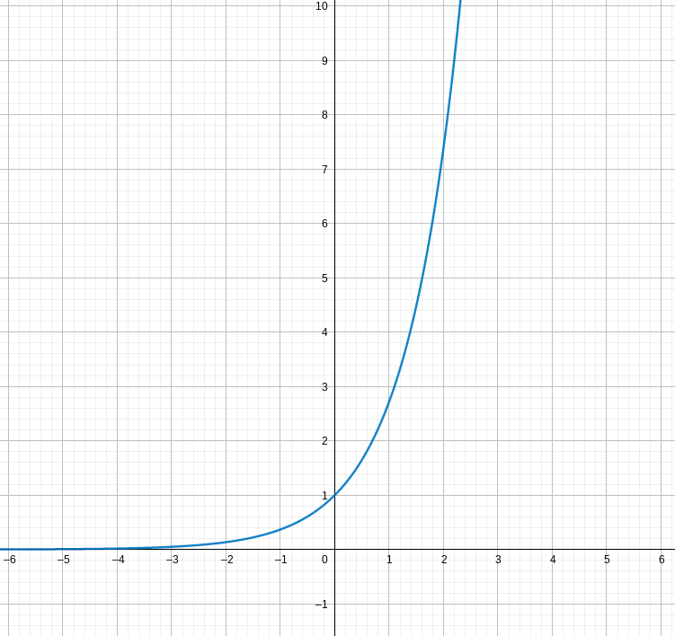
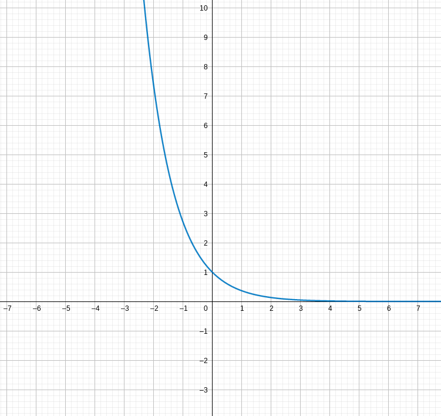
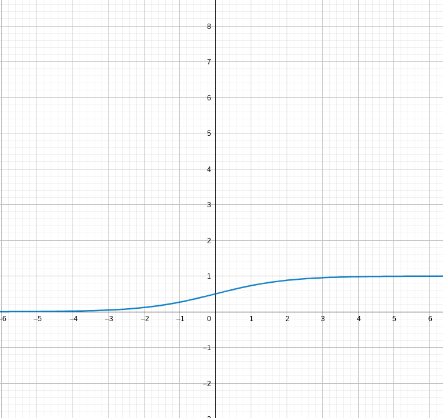

- Classification: predicting a qualitative response
- Classification Models:
  1. Logistic Regression
  2. Linear Discriminant Analysis
  3. Quadratic Discriminant Analysis
  4. Naive Bayes
  5. K-nearest Neighbors
- graph of $e^x$: 
- graph of $e^{-x}$ or $\frac{1}{e^x}$:
- graph of $\frac{e^x}{1+e^{x}}$: 
- Logistic Function (formula): $p(X)=\frac{e^{\beta_0+\beta_1X_1}}{1+e^{\beta_0+\beta_1X_1}}$
- Maximum Likelihood Estimation (MLE): a method of estimating thep arameters of an assumed probabiliyt distribution given some observed data; achieved by maximizing a likelihood function so that under the assumed statistics model the observed data is most probable
- Odds (formula): 