---

date: 2020-01-01

---

# 1.2 Initial Data Analysis

The following step of 'install.packages("faraway")' did not work 
and gave an error of: "installation of package ‘nloptr’ had non-zero exit status". 
It is required to install from the command line:

sudo apt-get install libnlopt-dev


```R
install.packages("faraway")
```

    Installing package into ‘/home/jeremyfbuss/R/x86_64-pc-linux-gnu-library/3.6’
    (as ‘lib’ is unspecified)
    
    also installing the dependencies ‘minqa’, ‘nloptr’, ‘Rcpp’, ‘RcppEigen’, ‘lme4’
    
    


```R
data(pima, package="faraway")
head(pima)
```


<table class="dataframe">
<caption>A data.frame: 6 × 9</caption>
<thead>
	<tr><th></th><th scope=col>pregnant</th><th scope=col>glucose</th><th scope=col>diastolic</th><th scope=col>triceps</th><th scope=col>insulin</th><th scope=col>bmi</th><th scope=col>diabetes</th><th scope=col>age</th><th scope=col>test</th></tr>
	<tr><th></th><th scope=col>&lt;int&gt;</th><th scope=col>&lt;int&gt;</th><th scope=col>&lt;int&gt;</th><th scope=col>&lt;int&gt;</th><th scope=col>&lt;int&gt;</th><th scope=col>&lt;dbl&gt;</th><th scope=col>&lt;dbl&gt;</th><th scope=col>&lt;int&gt;</th><th scope=col>&lt;int&gt;</th></tr>
</thead>
<tbody>
	<tr><th scope=row>1</th><td>6</td><td>148</td><td>72</td><td>35</td><td>  0</td><td>33.6</td><td>0.627</td><td>50</td><td>1</td></tr>
	<tr><th scope=row>2</th><td>1</td><td> 85</td><td>66</td><td>29</td><td>  0</td><td>26.6</td><td>0.351</td><td>31</td><td>0</td></tr>
	<tr><th scope=row>3</th><td>8</td><td>183</td><td>64</td><td> 0</td><td>  0</td><td>23.3</td><td>0.672</td><td>32</td><td>1</td></tr>
	<tr><th scope=row>4</th><td>1</td><td> 89</td><td>66</td><td>23</td><td> 94</td><td>28.1</td><td>0.167</td><td>21</td><td>0</td></tr>
	<tr><th scope=row>5</th><td>0</td><td>137</td><td>40</td><td>35</td><td>168</td><td>43.1</td><td>2.288</td><td>33</td><td>1</td></tr>
	<tr><th scope=row>6</th><td>5</td><td>116</td><td>74</td><td> 0</td><td>  0</td><td>25.6</td><td>0.201</td><td>30</td><td>0</td></tr>
</tbody>
</table>


```R
summary(pima)
```


        pregnant         glucose        diastolic         triceps     
     Min.   : 0.000   Min.   :  0.0   Min.   :  0.00   Min.   : 0.00  
     1st Qu.: 1.000   1st Qu.: 99.0   1st Qu.: 62.00   1st Qu.: 0.00  
     Median : 3.000   Median :117.0   Median : 72.00   Median :23.00  
     Mean   : 3.845   Mean   :120.9   Mean   : 69.11   Mean   :20.54  
     3rd Qu.: 6.000   3rd Qu.:140.2   3rd Qu.: 80.00   3rd Qu.:32.00  
     Max.   :17.000   Max.   :199.0   Max.   :122.00   Max.   :99.00  
        insulin           bmi           diabetes           age       
     Min.   :  0.0   Min.   : 0.00   Min.   :0.0780   Min.   :21.00  
     1st Qu.:  0.0   1st Qu.:27.30   1st Qu.:0.2437   1st Qu.:24.00  
     Median : 30.5   Median :32.00   Median :0.3725   Median :29.00  
     Mean   : 79.8   Mean   :31.99   Mean   :0.4719   Mean   :33.24  
     3rd Qu.:127.2   3rd Qu.:36.60   3rd Qu.:0.6262   3rd Qu.:41.00  
     Max.   :846.0   Max.   :67.10   Max.   :2.4200   Max.   :81.00  
          test      
     Min.   :0.000  
     1st Qu.:0.000  
     Median :0.000  
     Mean   :0.349  
     3rd Qu.:1.000  
     Max.   :1.000  


```R
sort(pima$diastolic)
```


<style>
.list-inline {list-style: none; margin:0; padding: 0}
.list-inline>li {display: inline-block}
.list-inline>li:not(:last-child)::after {content: "\00b7"; padding: 0 .5ex}
</style>
<ol class=list-inline><li>0</li><li>0</li><li>0</li><li>0</li><li>0</li><li>0</li><li>0</li><li>0</li><li>0</li><li>0</li><li>0</li><li>0</li><li>0</li><li>0</li><li>0</li><li>0</li><li>0</li><li>0</li><li>0</li><li>0</li><li>0</li><li>0</li><li>0</li><li>0</li><li>0</li><li>0</li><li>0</li><li>0</li><li>0</li><li>0</li><li>0</li><li>0</li><li>0</li><li>0</li><li>0</li><li>24</li><li>30</li><li>30</li><li>38</li><li>40</li><li>44</li><li>44</li><li>44</li><li>44</li><li>46</li><li>46</li><li>48</li><li>48</li><li>48</li><li>48</li><li>48</li><li>50</li><li>50</li><li>50</li><li>50</li><li>50</li><li>50</li><li>50</li><li>50</li><li>50</li><li>50</li><li>50</li><li>50</li><li>50</li><li>52</li><li>52</li><li>52</li><li>52</li><li>52</li><li>52</li><li>52</li><li>52</li><li>52</li><li>52</li><li>52</li><li>54</li><li>54</li><li>54</li><li>54</li><li>54</li><li>54</li><li>54</li><li>54</li><li>54</li><li>54</li><li>54</li><li>55</li><li>55</li><li>56</li><li>56</li><li>56</li><li>56</li><li>56</li><li>56</li><li>56</li><li>56</li><li>56</li><li>56</li><li>56</li><li>56</li><li>58</li><li>58</li><li>58</li><li>58</li><li>58</li><li>58</li><li>58</li><li>58</li><li>58</li><li>58</li><li>58</li><li>58</li><li>58</li><li>58</li><li>58</li><li>58</li><li>58</li><li>58</li><li>58</li><li>58</li><li>58</li><li>60</li><li>60</li><li>60</li><li>60</li><li>60</li><li>60</li><li>60</li><li>60</li><li>60</li><li>60</li><li>60</li><li>60</li><li>60</li><li>60</li><li>60</li><li>60</li><li>60</li><li>60</li><li>60</li><li>60</li><li>60</li><li>60</li><li>60</li><li>60</li><li>60</li><li>60</li><li>60</li><li>60</li><li>60</li><li>60</li><li>60</li><li>60</li><li>60</li><li>60</li><li>60</li><li>60</li><li>60</li><li>61</li><li>62</li><li>62</li><li>62</li><li>62</li><li>62</li><li>62</li><li>62</li><li>62</li><li>62</li><li>62</li><li>62</li><li>62</li><li>62</li><li>62</li><li>62</li><li>62</li><li>62</li><li>62</li><li>62</li><li>62</li><li>62</li><li>62</li><li>62</li><li>62</li><li>62</li><li>62</li><li>62</li><li>62</li><li>62</li><li>62</li><li>62</li><li>62</li><li>62</li><li>62</li><li>64</li><li>64</li><li>64</li><li>64</li><li>64</li><li>64</li><li>64</li><li>⋯</li><li>80</li><li>80</li><li>80</li><li>80</li><li>80</li><li>80</li><li>80</li><li>80</li><li>80</li><li>80</li><li>80</li><li>80</li><li>80</li><li>80</li><li>80</li><li>80</li><li>80</li><li>80</li><li>80</li><li>80</li><li>80</li><li>80</li><li>80</li><li>80</li><li>80</li><li>80</li><li>80</li><li>80</li><li>80</li><li>80</li><li>80</li><li>80</li><li>80</li><li>80</li><li>80</li><li>82</li><li>82</li><li>82</li><li>82</li><li>82</li><li>82</li><li>82</li><li>82</li><li>82</li><li>82</li><li>82</li><li>82</li><li>82</li><li>82</li><li>82</li><li>82</li><li>82</li><li>82</li><li>82</li><li>82</li><li>82</li><li>82</li><li>82</li><li>82</li><li>82</li><li>82</li><li>82</li><li>82</li><li>82</li><li>82</li><li>84</li><li>84</li><li>84</li><li>84</li><li>84</li><li>84</li><li>84</li><li>84</li><li>84</li><li>84</li><li>84</li><li>84</li><li>84</li><li>84</li><li>84</li><li>84</li><li>84</li><li>84</li><li>84</li><li>84</li><li>84</li><li>84</li><li>84</li><li>85</li><li>85</li><li>85</li><li>85</li><li>85</li><li>85</li><li>86</li><li>86</li><li>86</li><li>86</li><li>86</li><li>86</li><li>86</li><li>86</li><li>86</li><li>86</li><li>86</li><li>86</li><li>86</li><li>86</li><li>86</li><li>86</li><li>86</li><li>86</li><li>86</li><li>86</li><li>86</li><li>88</li><li>88</li><li>88</li><li>88</li><li>88</li><li>88</li><li>88</li><li>88</li><li>88</li><li>88</li><li>88</li><li>88</li><li>88</li><li>88</li><li>88</li><li>88</li><li>88</li><li>88</li><li>88</li><li>88</li><li>88</li><li>88</li><li>88</li><li>88</li><li>88</li><li>90</li><li>90</li><li>90</li><li>90</li><li>90</li><li>90</li><li>90</li><li>90</li><li>90</li><li>90</li><li>90</li><li>90</li><li>90</li><li>90</li><li>90</li><li>90</li><li>90</li><li>90</li><li>90</li><li>90</li><li>90</li><li>90</li><li>92</li><li>92</li><li>92</li><li>92</li><li>92</li><li>92</li><li>92</li><li>92</li><li>94</li><li>94</li><li>94</li><li>94</li><li>94</li><li>94</li><li>95</li><li>96</li><li>96</li><li>96</li><li>96</li><li>98</li><li>98</li><li>98</li><li>100</li><li>100</li><li>100</li><li>102</li><li>104</li><li>104</li><li>106</li><li>106</li><li>106</li><li>108</li><li>108</li><li>110</li><li>110</li><li>110</li><li>114</li><li>122</li></ol>


```R
pima$diastolic[pima$diastolic == 0] <- NA
pima$glucose[pima$glucose == 0] <- NA
pima$triceps[pima$triceps == 0] <- NA
pima$insulin[pima$insulin == 0] <- NA
pima$bmi[pima$bmi == 0] <- NA
```


```R
pima$test <- factor(pima$test)
summary(pima$test)
```


<style>
.dl-inline {width: auto; margin:0; padding: 0}
.dl-inline>dt, .dl-inline>dd {float: none; width: auto; display: inline-block}
.dl-inline>dt::after {content: ":\0020"; padding-right: .5ex}
.dl-inline>dt:not(:first-of-type) {padding-left: .5ex}
</style><dl class=dl-inline><dt>0</dt><dd>500</dd><dt>1</dt><dd>268</dd></dl>


```R
levels(pima$test) <- c("negative","positive")
summary(pima)
```


        pregnant         glucose        diastolic         triceps     
     Min.   : 0.000   Min.   : 44.0   Min.   : 24.00   Min.   : 7.00  
     1st Qu.: 1.000   1st Qu.: 99.0   1st Qu.: 64.00   1st Qu.:22.00  
     Median : 3.000   Median :117.0   Median : 72.00   Median :29.00  
     Mean   : 3.845   Mean   :121.7   Mean   : 72.41   Mean   :29.15  
     3rd Qu.: 6.000   3rd Qu.:141.0   3rd Qu.: 80.00   3rd Qu.:36.00  
     Max.   :17.000   Max.   :199.0   Max.   :122.00   Max.   :99.00  
                      NA's   :5       NA's   :35       NA's   :227    
        insulin            bmi           diabetes           age       
     Min.   : 14.00   Min.   :18.20   Min.   :0.0780   Min.   :21.00  
     1st Qu.: 76.25   1st Qu.:27.50   1st Qu.:0.2437   1st Qu.:24.00  
     Median :125.00   Median :32.30   Median :0.3725   Median :29.00  
     Mean   :155.55   Mean   :32.46   Mean   :0.4719   Mean   :33.24  
     3rd Qu.:190.00   3rd Qu.:36.60   3rd Qu.:0.6262   3rd Qu.:41.00  
     Max.   :846.00   Max.   :67.10   Max.   :2.4200   Max.   :81.00  
     NA's   :374      NA's   :11                                      
           test    
     negative:500  
     positive:268  
                   
                   
                   
                   
                   


```R
hist(pima$diastolic,xlab="Diastolic",main="")
```


    
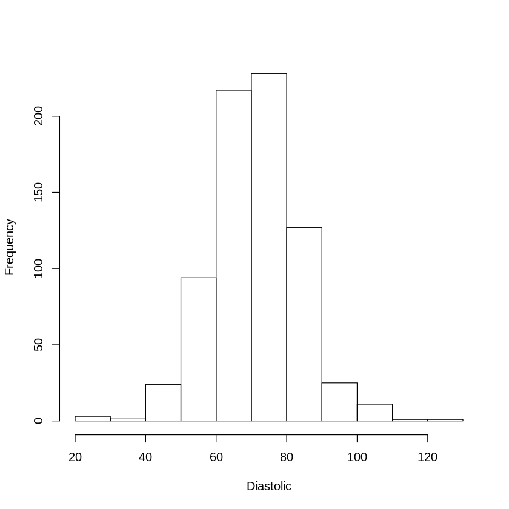
    


```R
plot(density(pima$diastolic, na.rm=TRUE),main="")
```


    
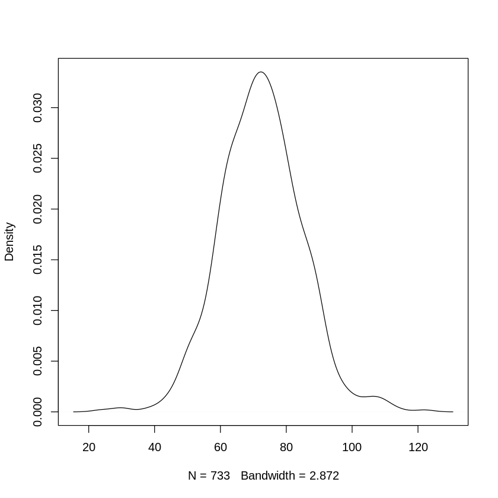
    


```R
plot(sort(pima$diastolic),ylab="Sorted Diastolic")
```


    
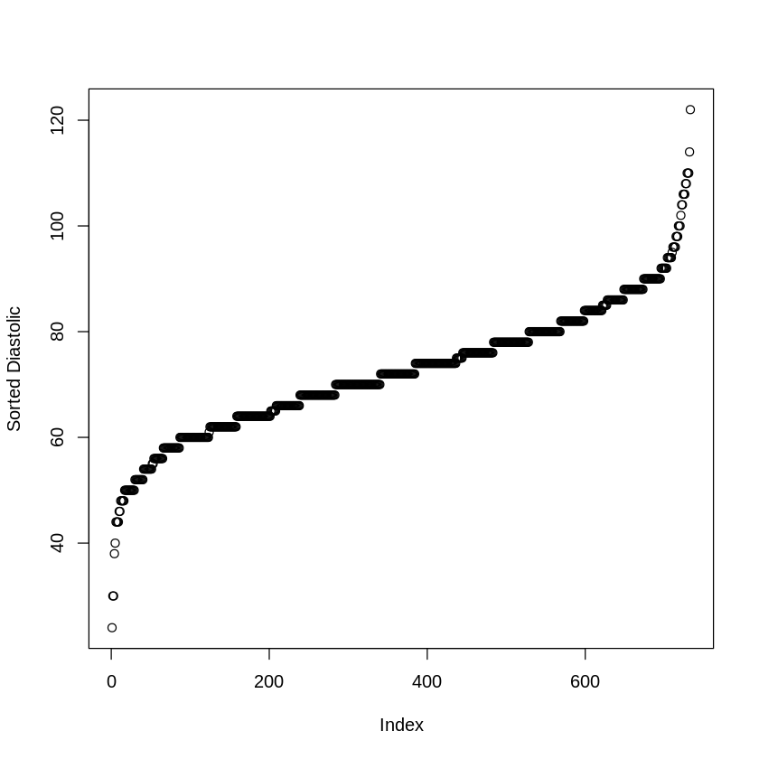
    


```R
plot(diabetes ~ diastolic,pima)
plot(diabetes ~ test, pima)
```


    
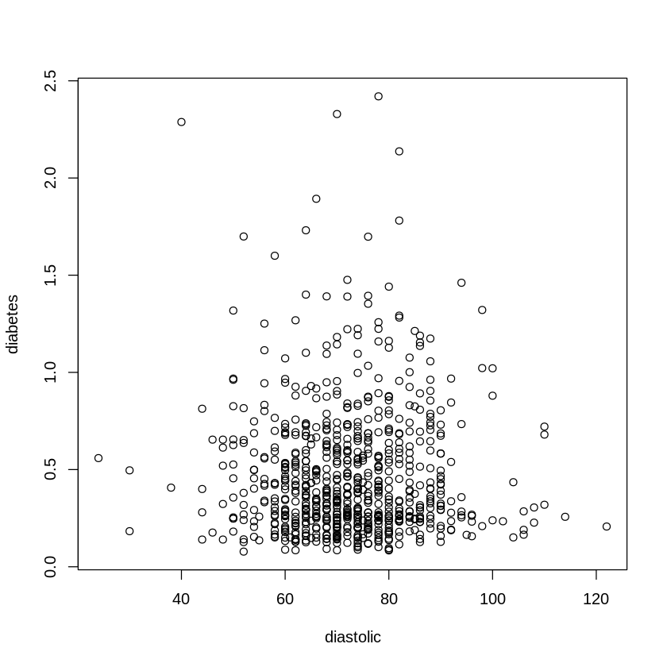
    


    
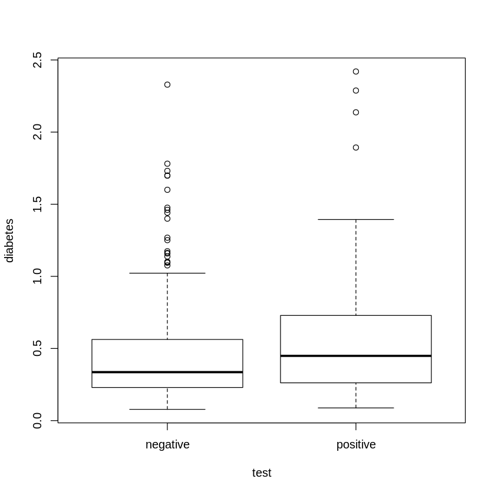
    


```R
install.packages("ggplot2")
```

    Installing package into ‘/home/jeremyfbuss/R/x86_64-pc-linux-gnu-library/3.6’
    (as ‘lib’ is unspecified)
    
    also installing the dependencies ‘colorspace’, ‘farver’, ‘labeling’, ‘munsell’, ‘R6’, ‘RColorBrewer’, ‘viridisLite’, ‘magrittr’, ‘pkgconfig’, ‘gtable’, ‘isoband’, ‘scales’, ‘tibble’, ‘withr’
    
    


```R
require(ggplot2)
ggplot(pima, aes(x=diastolic))+geom_histogram()
ggplot(pima, aes(x=diastolic))+geom_density()
ggplot(pima, aes(x=diastolic,y=diabetes))+geom_point()
```

    Loading required package: ggplot2
    
    `stat_bin()` using `bins = 30`. Pick better value with `binwidth`.
    
    Warning message:
    “Removed 35 rows containing non-finite values (stat_bin).”
    Warning message:
    “Removed 35 rows containing non-finite values (stat_density).”


    
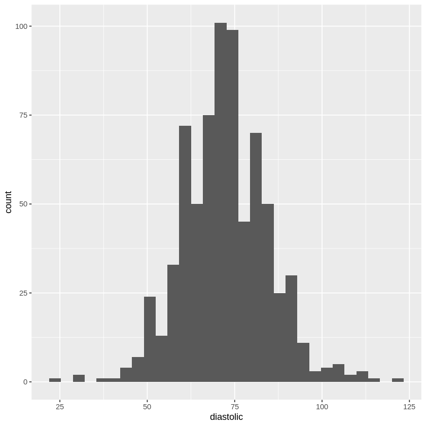
    


    Warning message:
    “Removed 35 rows containing missing values (geom_point).”


    
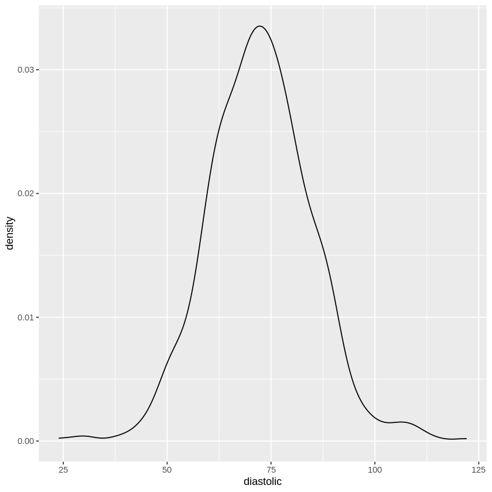
    


    
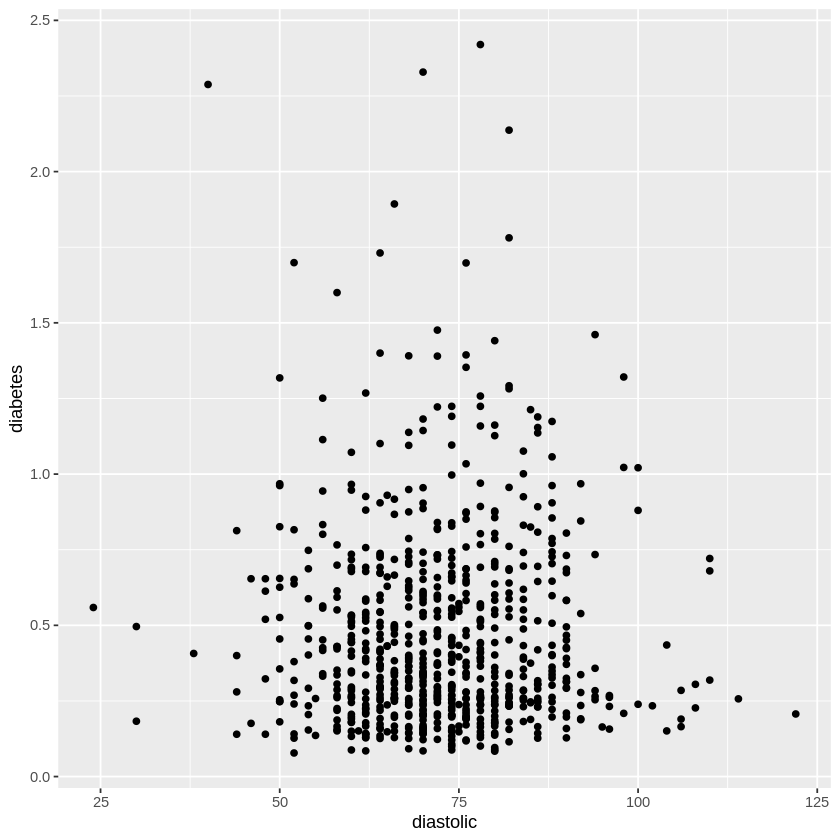
    


```R
ggplot(pima,aes(x=diastolic,y=diabetes,shape=test))+geom_point()+
    theme(legend.position = "top", legend.direction = "horizontal")
ggplot(pima,aes(x=diastolic,y=diabetes,shape=test))+geom_point(size=1)+
    facet_grid(~test)
```

    Warning message:
    “Removed 35 rows containing missing values (geom_point).”
    Warning message:
    “Removed 35 rows containing missing values (geom_point).”


    
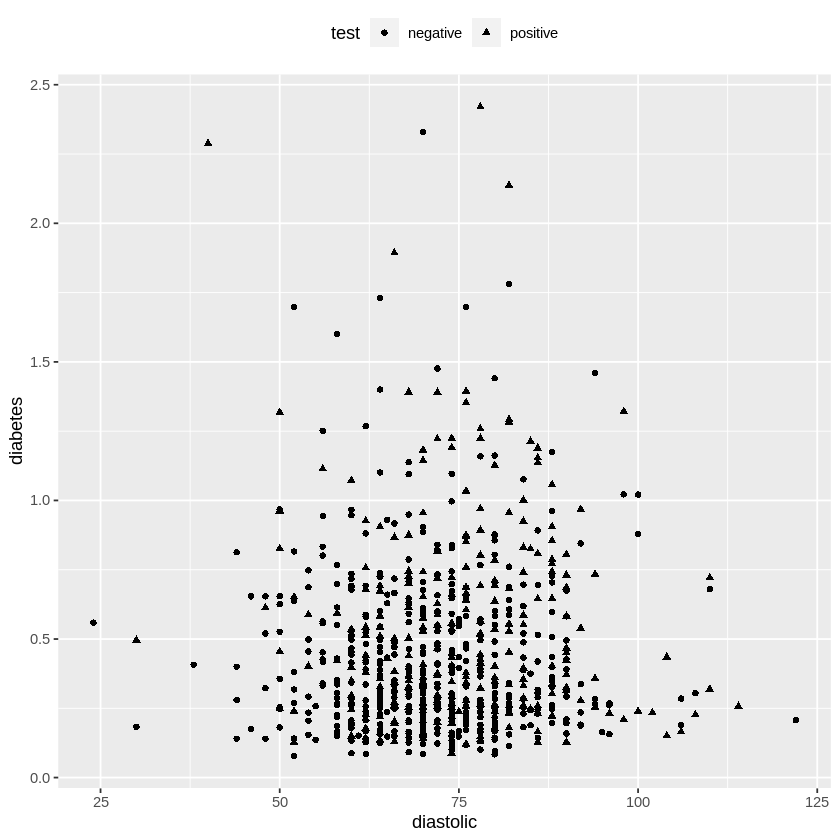
    


    
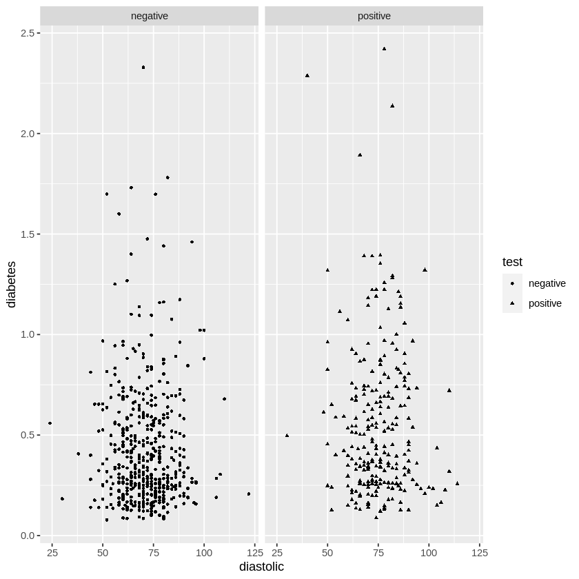
    


# 1.4 History


```R
data(manilius, package="faraway")
head(manilius)
```


<table class="dataframe">
<caption>A data.frame: 6 × 4</caption>
<thead>
	<tr><th></th><th scope=col>arc</th><th scope=col>sinang</th><th scope=col>cosang</th><th scope=col>group</th></tr>
	<tr><th></th><th scope=col>&lt;dbl&gt;</th><th scope=col>&lt;dbl&gt;</th><th scope=col>&lt;dbl&gt;</th><th scope=col>&lt;int&gt;</th></tr>
</thead>
<tbody>
	<tr><th scope=row>1</th><td>13.16667</td><td>0.8836</td><td>-0.4682</td><td>1</td></tr>
	<tr><th scope=row>2</th><td>13.13333</td><td>0.9996</td><td>-0.0282</td><td>1</td></tr>
	<tr><th scope=row>3</th><td>13.20000</td><td>0.9899</td><td> 0.1421</td><td>1</td></tr>
	<tr><th scope=row>4</th><td>14.25000</td><td>0.2221</td><td> 0.9750</td><td>3</td></tr>
	<tr><th scope=row>5</th><td>14.70000</td><td>0.0006</td><td> 1.0000</td><td>3</td></tr>
	<tr><th scope=row>6</th><td>13.01667</td><td>0.9308</td><td>-0.3654</td><td>1</td></tr>
</tbody>
</table>


```R
(moon3 <- aggregate(manilius[,1:3],list(manilius$group), sum))
```


<table class="dataframe">
<caption>A data.frame: 3 × 4</caption>
<thead>
	<tr><th scope=col>Group.1</th><th scope=col>arc</th><th scope=col>sinang</th><th scope=col>cosang</th></tr>
	<tr><th scope=col>&lt;int&gt;</th><th scope=col>&lt;dbl&gt;</th><th scope=col>&lt;dbl&gt;</th><th scope=col>&lt;dbl&gt;</th></tr>
</thead>
<tbody>
	<tr><td>1</td><td>118.1333</td><td> 8.4987</td><td>-0.7932</td></tr>
	<tr><td>2</td><td>140.2833</td><td>-6.1404</td><td> 1.7443</td></tr>
	<tr><td>3</td><td>127.5333</td><td> 2.9777</td><td> 7.9649</td></tr>
</tbody>
</table>


```R
solve(cbind(9,moon3$sinang,moon3$cosang), moon3$arc)
```


<style>
.list-inline {list-style: none; margin:0; padding: 0}
.list-inline>li {display: inline-block}
.list-inline>li:not(:last-child)::after {content: "\00b7"; padding: 0 .5ex}
</style>
<ol class=list-inline><li>14.5445859137107</li><li>-1.48982207122808</li><li>0.134126390969478</li></ol>


```R
lmod <- lm(arc ~ sinang + cosang, manilius)
coef(lmod)
```


<style>
.dl-inline {width: auto; margin:0; padding: 0}
.dl-inline>dt, .dl-inline>dd {float: none; width: auto; display: inline-block}
.dl-inline>dt::after {content: ":\0020"; padding-right: .5ex}
.dl-inline>dt:not(:first-of-type) {padding-left: .5ex}
</style><dl class=dl-inline><dt>(Intercept)</dt><dd>14.5616235099011</dd><dt>sinang</dt><dd>-1.50458123407611</dd><dt>cosang</dt><dd>0.0913650401188756</dd></dl>


```R
install.packages("HistData")
```

    Installing package into ‘/home/jeremyfbuss/R/x86_64-pc-linux-gnu-library/3.6’
    (as ‘lib’ is unspecified)
    


```R
data(GaltonFamilies, package="HistData")
plot(childHeight ~ midparentHeight, GaltonFamilies)
```


    
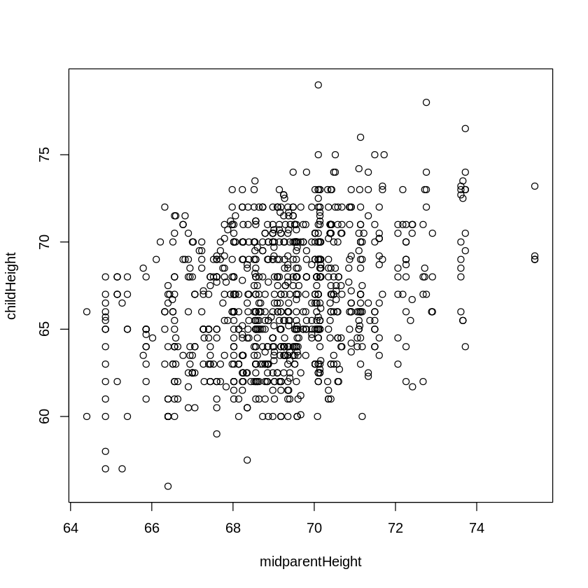
    


```R
lmod <- lm(childHeight ~ midparentHeight, GaltonFamilies)
coef(lmod)
```


<style>
.dl-inline {width: auto; margin:0; padding: 0}
.dl-inline>dt, .dl-inline>dd {float: none; width: auto; display: inline-block}
.dl-inline>dt::after {content: ":\0020"; padding-right: .5ex}
.dl-inline>dt:not(:first-of-type) {padding-left: .5ex}
</style><dl class=dl-inline><dt>(Intercept)</dt><dd>22.6362405495899</dd><dt>midparentHeight</dt><dd>0.637360896969475</dd></dl>


```R
plot.new()
abline(lmod)
```


    

    


```R
(beta <- with(GaltonFamilies, 
    cor(midparentHeight, childHeight) * sd(childHeight) / sd(midparentHeight)))
```


0.637360896969479


```R
(alpha <- with(GaltonFamilies, 
    mean(childHeight) - beta * mean(midparentHeight)))
```


22.6362405495898


```R
(beta1 <- with(GaltonFamilies, 
    sd(childHeight) / sd(midparentHeight)))
```


1.98585793230001


```R
(alpha1 <- with(GaltonFamilies, 
    mean(childHeight) - beta1 * mean(midparentHeight)))
```


-70.6888876916918


```R
abline(alpha1, beta1, lty=2)
```


    Error in int_abline(a = a, b = b, h = h, v = v, untf = untf, ...): plot.new has not been called yet
    Traceback:


    1. abline(alpha1, beta1, lty = 2)

    2. int_abline(a = a, b = b, h = h, v = v, untf = untf, ...)


```R

```
